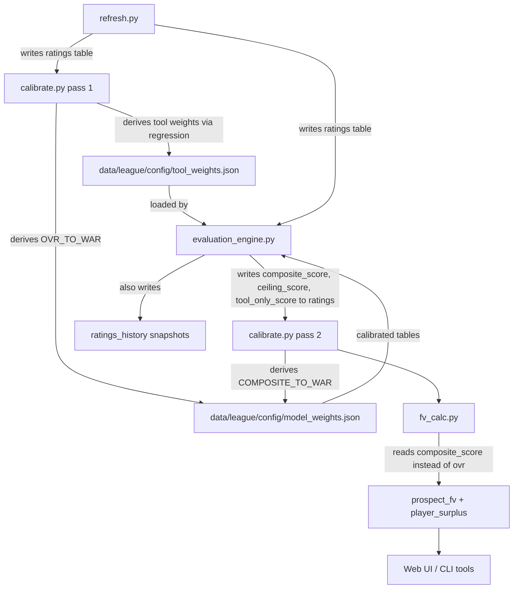

# Design Document: Custom Player Evaluation

## Overview

This design introduces an **Evaluation Engine** that computes `Composite_Score` and `Ceiling_Score` for every player from individual tool ratings, replacing the system's dependency on the OOTP game engine's OVR/POT ratings. The engine integrates into the existing data pipeline between `refresh.py` (data pull) and `fv_calc.py` (FV/surplus computation), producing scores that feed all downstream models.

### Design Goals

1. **Independence from OVR/POT** — Composite_Score and Ceiling_Score are computed entirely from tool ratings, stats, and age/level context. OVR/POT are never inputs.
2. **Transparency** — Every score is decomposable into weighted tool contributions. Users can see *why* a player scores the way they do.
3. **Configurability** — Tool weights are per-league, per-position, stored in JSON config files.
4. **Backward compatibility** — Existing OVR/POT columns are preserved. All downstream models (FV, WAR, surplus, arb) accept Composite_Score as a drop-in replacement for OVR.
5. **Graceful degradation** — The system works identically whether or not OVR/POT are available in the league data.

### Key Design Decision: 20-80 Scale Output

Composite_Score and Ceiling_Score are produced on the 20-80 scouting scale (rounded to nearest integer) to match the existing OVR/POT scale used throughout the system. This means all downstream consumers (`peak_war_from_ovr()`, `calc_fv()`, `arb_salary()`, calibration regression, UI grade bars) work with the same numeric range and require minimal interface changes — they accept a score on the 20-80 scale regardless of whether it came from OVR or the Evaluation Engine.

---

## Architecture

### Pipeline Integration



The Evaluation Engine runs as a new step in the refresh pipeline, **after** `refresh.py` writes the `ratings` table and **before** `fv_calc.py` reads it. This is the same position where `calibrate.py` currently runs.

**Execution order in refresh pipeline:**
1. `refresh.py` — pulls data from API, writes `ratings`, `players`, stats tables
2. `calibrate.py` (pass 1) — derives tool weights via regression (new), derives OVR_TO_WAR tables
3. **`evaluation_engine.py`** — computes Composite_Score, Ceiling_Score, Tool_Only_Score for all players using calibrated tool weights, writes to `ratings` table
4. `calibrate.py` (pass 2) — derives COMPOSITE_TO_WAR tables from freshly computed composite scores (skipped on first run when no composite scores exist yet)
5. `fv_calc.py` — reads Composite_Score/Ceiling_Score instead of OVR/POT for FV and surplus

### New Module: `scripts/evaluation_engine.py`

A new module containing all score computation logic. All computation functions are **pure functions** — no hidden state, no global mutable variables, no side effects. Database access is confined to the batch entry point (`run()`) and passed via dependency injection. Every public function has explicit type annotations serving as interface contracts.

**Design Principles (SOLID):**
- **Single Responsibility**: Each function does one thing. `compute_composite_hitter` computes a hitter score; it doesn't load weights or write to the DB.
- **Open/Closed**: New positional buckets or tool types can be added via configuration without modifying computation functions.
- **Dependency Inversion**: All functions that need data accept it as parameters. No function creates its own DB connection or reads config files internally.
- **Pure Functions**: All computation functions are deterministic — same inputs always produce the same output. This makes every function independently unit-testable with no setup or teardown.

**Public API:**
```python
# Core computation (pure functions — no DB access, no side effects)
def compute_composite_hitter(tools: dict, weights: dict, defense: dict, def_weights: dict) -> int
def compute_composite_pitcher(tools: dict, weights: dict, arsenal: dict, stamina: int, role: str) -> int
def compute_composite_mlb(tool_score: int, stat_signal: float, blend_weight: float) -> int
def compute_ceiling(potential_tools: dict, weights: dict, accuracy: str, work_ethic: str) -> int
def compute_tool_only_score(tools: dict, weights: dict) -> int

# Two-way player handling (pure functions)
def is_two_way_player(tools: dict, batting_stats: list | None, pitching_stats: list | None) -> bool
def compute_two_way_scores(hitting_tools: dict, pitching_tools: dict, hitter_weights: dict, pitcher_weights: dict, ...) -> dict
def compute_combined_value(primary_composite: int, secondary_composite: int) -> int

# Tool weight derivation (pure functions — accept data, return weights)
def derive_tool_weights(tool_ratings: list[dict], target_values: list[float], min_n: int = 40) -> dict | None
def normalize_coefficients(coefficients: dict) -> dict
def recombine_component_weights(hitting_coeffs: dict, baserunning_coeffs: dict, defense_coeff: float, recombination: dict) -> dict

# Divergence detection (pure function)
def detect_divergence(tool_only_score: int, ovr: int | None) -> dict | None

# Tool profile analysis (pure functions)
def classify_archetype(tools: dict, composite: int) -> str
def identify_carrying_tools(tools: dict, composite: int) -> list
def identify_red_flag_tools(tools: dict, composite: int) -> list

# Configuration loading (I/O boundary — reads config, returns data)
def load_tool_weights(league_dir: Path) -> dict
def validate_tool_weights(weights: dict) -> bool

# Batch pipeline entry point (ONLY function with side effects — DB reads/writes)
def run(league_dir: Path = None, conn: sqlite3.Connection = None) -> None
```

**Dependency injection pattern**: The `run()` function accepts an optional `conn` parameter. In production, it creates its own connection; in tests, a test-scoped in-memory SQLite connection is injected. All pure computation functions are called by `run()` with data extracted from the DB — they never touch the DB themselves.

### Configuration: `config/tool_weights.json`

A new per-league config file alongside `league_settings.json` and `model_weights.json`. Contains positional tool weight profiles. **Stored per-league** at `data/<league>/config/tool_weights.json` — each league gets its own weights derived from its own data.

---

## Components and Interfaces

### 1. Evaluation Engine (`scripts/evaluation_engine.py`)

#### Hitter Composite Score (Prospects)

For prospect hitters, the Composite_Score is a weighted sum of normalized tool ratings:

```
Composite_Score = Σ(tool_i × weight_i) for all offensive tools
                + defensive_component × positional_weight
```

**Offensive tools** (normalized to 20-80 via existing `norm()` from `ratings.py`):
- Contact (`cntct`), Gap (`gap`), Power (`pow`), Eye (`eye`), Avoid-K (`ks`), Speed (`speed`)

Speed is included as a hitting regression feature because it contributes to batting average (infield hits, beating out grounders) and slugging (stretching doubles into triples). The regression will naturally determine how much speed contributes to OPS+ — if it's significant, it gets weight; if not, the coefficient will be near zero.

**L/R split handling**: When split ratings are available (`cntct_l`, `cntct_r`, etc.), the engine uses a weighted average based on expected plate appearance distribution:
- vs RHP: 60% weight (majority of PAs)
- vs LHP: 40% weight
- Falls back to overall rating when splits are unavailable

**Defensive component**: Uses the existing `DEFENSIVE_WEIGHTS` from `fv_model.py` (C: framing/blocking/arm, SS: range/error/arm/TDP, etc.) to compute a weighted defensive score, then scales it by a positional importance factor from the tool weights config.

**Output**: Clamped to [20, 80], rounded to nearest integer.

#### Pitcher Composite Score (Prospects)

```
Composite_Score = Σ(pitch_tool_i × weight_i)  # stuff, movement, control
                + arsenal_bonus
                + stamina_adjustment
                + platoon_balance_adjustment
```

**Arsenal depth bonus**: +1 per pitch rated 45+ beyond the third pitch (capped at +3). Top-pitch quality bonus: +1 if best pitch ≥ 65, +2 if ≥ 70.

**Stamina penalty**: For SP role, stamina < 40 applies a penalty: `penalty = (40 - stamina) × 0.15`, capped at -5 points.

**Platoon balance**: When L/R stuff splits are available, severe imbalance (weak side < 35, gap ≥ 15) applies -2 to -3 penalty, consistent with the existing `calc_fv()` platoon penalty.

**Role determination**: Uses existing `assign_bucket()` from `player_utils.py` to determine SP vs RP before scoring.

#### MLB Player Composite Score (Stat Blending)

For MLB players with qualifying seasons, the Composite_Score blends tool ratings with stat performance:

```
Tool_Only_Score = compute_composite_hitter(current_tools, weights, ...)  # or pitcher variant
Stat_Signal = normalize_to_2080(rate_stat)  # OPS+ for hitters, ERA+/FIP for pitchers
blend_weight = min(0.5, seasons_qualified × 0.15)  # 0.15 per season, max 0.50
Composite_Score = Tool_Only_Score × (1 - blend_weight) + Stat_Signal × blend_weight
```

**Stat normalization**: Rate stats (OPS+ for hitters, inverse ERA+/FIP blend for pitchers) are already league-normalized. They're mapped to the 20-80 scale:
- 100 (league average) → 50
- Each 10 points of OPS+ ≈ 5 points on the 20-80 scale
- Formula: `stat_2080 = 20 + (stat_plus / 200) × 60`, clamped [20, 80]

**Recency weighting**: Consistent with existing `stat_peak_war()` methodology — most recent season weighted 3×, second most 2×, third 1×.

**Young player blend**: For players under peak age whose tools suggest more upside than stats show, the blend weight is reduced (tools weighted more heavily), matching the existing young-player logic in `contract_value.py`.

**Tool_Only_Score retention**: The pre-blend score is always stored separately for divergence detection (Requirement 3.6, 6.7).

#### Ceiling Score

```
Ceiling_Score = compute_composite(potential_tools, weights, ...)  # same formula, potential ratings
              + work_ethic_modifier
              + accuracy_variance
```

**Floor constraint**: `Ceiling_Score = max(Ceiling_Score, Composite_Score)` — ceiling is never below current ability.

**Work ethic modifier**: High/VH → +1, Low → -1 (matching existing `calc_fv()` work ethic logic).

**Accuracy variance**: When `Acc=L`, apply a variance penalty of -2 (consistent with existing FV accuracy penalty). This represents reduced confidence in the ceiling projection.

#### Divergence Detection

Compares Tool_Only_Score (not stat-blended Composite_Score) against OVR:

```python
def detect_divergence(tool_only_score: int, ovr: int | None) -> dict | None:
    if ovr is None:
        return None
    diff = tool_only_score - ovr
    if abs(diff) < 5:
        return {"type": "agreement", "magnitude": diff}
    return {
        "type": "hidden_gem" if diff >= 5 else "landmine",
        "magnitude": diff,
        "tool_only_score": tool_only_score,
        "ovr": ovr,
    }
```

Similarly for Ceiling_Score vs POT.

#### Tool Profile Insights

**Archetype classification** based on tool distribution relative to composite:

| Archetype | Hitter Criteria | Pitcher Criteria |
|---|---|---|
| Contact-first | Contact ≥ Composite + 10, Power < Composite | — |
| Power-over-hit | Power ≥ Composite + 10, Contact < Composite | — |
| Balanced | All tools within ±8 of Composite | All tools within ±8 |
| Elite defender | Defensive score ≥ 65, offensive tools < Composite | — |
| Speed-first | Speed ≥ Composite + 15 | — |
| Stuff-over-command | — | Stuff ≥ Composite + 10, Control < Composite |
| Command-over-stuff | — | Control ≥ Composite + 10, Stuff < Composite |
| Pitch-mix specialist | — | Arsenal depth ≥ 4 pitches at 50+, no single pitch ≥ 65 |

**Carrying tools**: Any tool rated 15+ points above Composite_Score.
**Red-flag tools**: Any tool rated 15+ points below Composite_Score.

#### Two-Way Player Handling

Two-way players in OOTP have both hitting ratings (contact, gap, power, eye, avoid-K, speed) and pitching ratings (stuff, movement, control) with non-trivial values. They may appear in both `batting_stats` and `pitching_stats`. The existing `war_model.py` already handles two-way players via `_two_way_peak_war()`, which sums batting and pitching WAR.

**Identification** (tiered approach, checked in order):

1. **Stat-based ground truth**: If the player's ID is in the `two_way` set from `war_model.load_stat_history()`, they are two-way. This set identifies players with qualifying seasons in both batting (AB ≥ 130) and pitching (GS ≥ 10) in the same year. This is the most reliable signal.

2. **Stat-based local**: If `batting_stats` and `pitching_stats` are provided, checks for overlapping qualifying years (AB ≥ 130 and IP ≥ 40 in the same season).

3. **Tool-based (prospects)**: For players without stat history, requires:
   - The player must be a **pitcher** (`is_pitcher=True`) — hitters with non-zero pitcher ratings are NOT two-way
   - Hitting tools must be well above pitcher norms: `contact >= 45` AND `power >= 40`

> **Tuning note (2026-04-19):** The original tool-based thresholds (contact ≥ 35, power ≥ 30) were too permissive. On the VMLB league (20-80 scale), every player has all tools populated at 20+, and the old thresholds flagged 9,649 of 15,012 players (64%) as two-way. The root causes were: (a) no `is_pitcher` precondition, so hitters with default pitcher ratings qualified; (b) thresholds too close to the floor on 20-80 scale leagues where median pitcher contact=20 and power=20. The fix raised thresholds to contact ≥ 45, power ≥ 40 and added the `is_pitcher` requirement, yielding ~56 realistic two-way candidates on VMLB. The stat-based tier from `war_model` was also integrated as the primary detection path.

**Dual scoring**: The engine computes two separate Composite_Scores:
```
hitter_composite = compute_composite_hitter(hitting_tools, hitter_weights[bucket], defense, def_weights)
pitcher_composite = compute_composite_pitcher(pitching_tools, pitcher_weights[role], arsenal, stamina, role)
```

**Primary vs secondary**: The higher score becomes the primary `composite_score` stored in the `ratings` table. The lower score is stored in a new `secondary_composite` column. This ensures downstream consumers (FV, surplus, WAR) that read `composite_score` get the player's best role.

**Combined value**: For FV and surplus calculations, two-way players need a combined value that reflects total contribution. The combined score is:
```
combined_value = primary_composite + secondary_bonus
secondary_bonus = (secondary_composite - 35) × 0.3  # only if secondary > 35 (replacement level)
```

The 0.3 scaling reflects that the secondary role provides partial additional value — a pitcher who can also hit at a 55 level adds meaningful value beyond a pitcher-only profile, but not as much as a full-time 55 hitter would. The bonus is capped at +8 points to prevent two-way players from scoring unrealistically high.

This combined value feeds into `fv_calc.py` as the effective Composite_Score for two-way players, consistent with how `_two_way_peak_war()` in `war_model.py` already sums batting and pitching WAR for stat-based projections.

**Ceiling_Score**: Computed for each role separately using potential tools. The primary Ceiling_Score is the higher of the two role ceilings. The secondary ceiling is stored alongside.

**Stat blending for MLB two-way players**: When the player has qualifying seasons in both batting and pitching:
- Hitter composite blends with OPS+ (from batting_stats)
- Pitcher composite blends with FIP (from pitching_stats)
- Each role's stat blend is independent

**Web UI display**: The player page shows both role scores with clear labels:
```
Composite: 58 (Pitcher) / 52 (Hitter)  |  Ceiling: 65 / 55
Combined Value: 63
```

**Divergence detection**: Uses the primary Composite_Score vs OVR, since OVR is the game engine's single combined assessment.

**Database columns**: The new `secondary_composite` column in the `ratings` table stores the secondary role score. NULL for single-role players.

#### Score Compression and Elite Tool Bonus

> **Tuning note (2026-04-19):** On 20-80 scale leagues, the composite formula (a weighted average of tools) was compressed to an effective range of ~30-62, while OVR ranged 20-80. The root cause: a weighted average mathematically cannot reach 80 unless *every* tool is 80. In practice, elite players have a mix of 55-70 tools, so the average tops out around 60-62.
>
> **Fix applied:** An elite tool bonus of +0.5 per tool point above 60 (weighted by tool importance) was added to both `compute_composite_hitter()` and `compute_composite_pitcher()`. This expands the effective top-end range by ~3-5 points for elite players without affecting average or below-average players. The bonus is modest by design — it rewards elite tools without creating runaway scores.
>
> **Remaining offset:** The composite averages ~13 points higher than OVR for minor league players. This is expected and correct — OVR factors in development/experience (a rookie with 35 contact gets a low OVR because OOTP knows they haven't developed yet), while the composite measures current tool quality at face value. At the MLB level, the composite and OVR nearly agree (diff = +0.6). This offset is a feature, not a bug — it means the composite is a better measure of raw talent for prospect evaluation.
>
> **Future tuning options if needed:**
> - Increase the elite bonus multiplier (currently 0.5) to expand the top end further
> - Add a non-linear combination that rewards the *best* tools more aggressively
> - Apply a level-based adjustment to align with OVR at lower levels (not recommended — the offset is informative)

### 2. Tool Weight Configuration (`config/tool_weights.json`)

**Per-league storage**: Each league has its own `tool_weights.json` at `data/<league>/config/tool_weights.json`. This is the same directory pattern used by `league_settings.json`, `state.json`, `model_weights.json`, and `league_averages.json`. Tool weights are **never shared across leagues** — each league's calibration produces weights specific to that league's run environment and tool-to-stat correlations.

#### Weight Derivation: Component-Level Regression Approach

Tool weights are **derived empirically** from the league's own historical data rather than hand-tuned. Critically, the regression runs **per-league** — each league's own data produces its own weight profiles, stored in that league's `data/<league>/config/tool_weights.json`. A deadball-era league where contact and speed dominate will produce different weights than a steroid-era league where power is king.

Rather than regressing all tools against a single WAR target (which conflates offensive, defensive, and baserunning value), the calibration pipeline uses **component-level regressions** against domain-specific performance metrics:

| Component | Tools Regressed | Target Metric | Source |
|---|---|---|---|
| **Hitting** | contact, gap, power, eye, avoid-K, speed | OPS+ (computed from batting_stats + league averages) | `batting_stats` (AB ≥ 300) |
| **Baserunning** | speed, stealing ability (`steal`), stealing aggressiveness (`stl_rt`) | SB success rate (SB / (SB + CS)), total SB | `batting_stats` (AB ≥ 300, SB + CS ≥ 5) |
| **Fielding** | defensive composite (from `DEFENSIVE_WEIGHTS`) | ZR (zone rating) | `fielding_stats` (IP ≥ 400) |
| **Pitching** | stuff, movement, control + arsenal quality | FIP (computed: `(13×HR + 3×BB - 2×K) / IP + C_FIP`) | `pitching_stats` (IP ≥ 40 SP, ≥ 20 RP) |

**Why component-level instead of WAR-only?** A single WAR regression can produce misleading weights because WAR bundles offense, defense, and baserunning. A tool like speed might appear to have zero WAR correlation because its baserunning value is offset by the fact that fast players tend to be weaker hitters — the confounding washes out the real signal. By regressing speed against stolen base metrics directly, we isolate the tool's actual predictive power within its domain. Speed is also included in the hitting regression because it contributes to batting average (infield hits) and slugging (stretching doubles into triples) — the regression determines the actual magnitude of this contribution.

**Why all three running tools for baserunning?** OOTP has three separate running-related ratings that each predict different aspects of baserunning value:
- **Speed** (`speed`) — raw running speed, affects base advancement and triples
- **Stealing ability** (`steal`) — skill at reading pitchers and getting good jumps, predicts SB success rate
- **Stealing aggressiveness** (`stl_rt`) — willingness to attempt steals, predicts SB attempt frequency

Using all three captures the full baserunning picture: a player with high speed but low stealing aggressiveness won't attempt many steals, while a player with high stealing ability but average speed may still be an efficient base stealer.

**Available stats in the database** (verified against `db.py` schema):
- `batting_stats`: ab, h, d, t, hr, r, rbi, sb, bb, k, avg, obp, slg, war, pa, cs — sufficient to compute OPS+ using league averages from `league_averages.json`
- `pitching_stats`: ip, k, bb, hra, bf, er, war, ra9war — sufficient to compute FIP
- `fielding_stats`: zr, e, dp, framing, arm — ZR is the primary fielding metric; errors available as secondary
- `ratings` table: `speed`, `steal`, `stl_rt` — all three running-related tools available for baserunning regression
- `league_averages.json`: league-wide OPS, ERA, and other baselines for normalization

**OPS+ computation**: `OPS+ = 100 × (OBP / lgOBP + SLG / lgSLG - 1)`, using league averages from `league_averages.json`. This is computed at calibration time for each qualifying hitter-season.

**FIP computation**: `FIP = (13 × HR + 3 × (BB + HBP) - 2 × K) / IP + C_FIP`, where `C_FIP` is derived from league ERA and league FIP components. The `pitching_stats` table has all required fields (hra, bb, hp, k, ip).

#### Component Recombination

After running separate regressions for each component domain, the coefficients must be recombined into a single unified weight profile per positional bucket. This uses **position-specific recombination weights** that reflect how much of a position's total value comes from each domain.

> **Note:** These recombination shares are initial estimates subject to calibration and validation against real data. They should be treated as reasonable starting defaults, not ground truth. Future work may derive these shares empirically or allow per-league overrides.

| Position | Offense Share | Defense Share | Baserunning Share |
|---|---|---|---|
| C | 0.60 | 0.35 | 0.05 |
| SS | 0.55 | 0.35 | 0.10 |
| 2B | 0.60 | 0.25 | 0.15 |
| 3B | 0.65 | 0.25 | 0.10 |
| CF | 0.50 | 0.35 | 0.15 |
| COF | 0.70 | 0.20 | 0.10 |
| 1B | 0.80 | 0.15 | 0.05 |

For pitchers, the regression is a single domain (pitching tools → FIP), so no recombination is needed.

**Recombination process:**
1. Run hitting regression: `OPS+ ~ contact + gap + power + eye + avoid_k + speed` → produces hitting coefficients (normalized to sum to 1.0). Speed is included because it contributes to batting average (infield hits) and slugging (stretching doubles into triples).
2. Run baserunning regression: `SB_rate ~ speed + steal + stl_rt` → produces baserunning coefficients (normalized to sum to 1.0). Uses all three running-related tools from the OOTP engine.
3. Run fielding regression: `ZR ~ defensive_composite` → produces a single fielding coefficient (always 1.0)
4. Scale each component's coefficients by the position's domain share:
   - `final_contact_weight = hitting_contact_coeff × offense_share`
   - `final_speed_weight_hitting = hitting_speed_coeff × offense_share` (speed's contribution to hitting)
   - `final_speed_weight_baserunning = baserunning_speed_coeff × baserunning_share` (speed's contribution to baserunning)
   - `final_speed_weight = final_speed_weight_hitting + final_speed_weight_baserunning` (total speed weight)
   - `final_steal_weight = baserunning_steal_coeff × baserunning_share`
   - `final_stl_rt_weight = baserunning_stl_rt_coeff × baserunning_share`
   - `final_defense_weight = 1.0 × defense_share`
5. Normalize the full set of final weights to sum to 1.0

**Example for SS** (offense 0.55, defense 0.35, baserunning 0.10):
- Hitting regression yields: contact=0.25, gap=0.13, power=0.17, eye=0.17, avoid_k=0.13, speed=0.15
- After scaling by offense share (0.55): contact=0.138, gap=0.072, power=0.094, eye=0.094, avoid_k=0.072, speed_hitting=0.083
- Baserunning regression yields: speed=0.50, steal=0.30, stl_rt=0.20
- After scaling by baserunning share (0.10): speed_baserunning=0.05, steal=0.03, stl_rt=0.02
- Total speed = 0.083 + 0.05 = 0.133
- Defense gets defense_share: defense=0.35
- Total ≈ 1.0 (normalized)

**Fallback**: When a component regression fails (insufficient data or R² < 0.05), the corresponding default weights for that component are used. If all component regressions fail for a bucket, the full default weight profile is retained.

This approach mirrors the existing `_calibrate_ovr_to_war()` methodology in `calibrate.py` — same data window (`CALIBRATION_YEARS`), same minimum sample size (`MIN_REGRESSION_N`), same per-bucket structure.

#### Regression Data Sources

| Component | Tool Columns (from `ratings`) | Target Metric | Source Table | Qualifying Threshold |
|---|---|---|---|---|
| Hitting | `cntct`, `gap`, `pow`, `eye`, `ks`, `speed` (normalized via `norm()`) | OPS+ (computed from obp, slg, league averages) | `batting_stats` | AB ≥ 300, `split_id=1` |
| Baserunning | `speed`, `steal`, `stl_rt` (normalized via `norm()`) | SB success rate: `SB / (SB + CS)` | `batting_stats` | AB ≥ 300, SB + CS ≥ 5 |
| Fielding | Defensive composite (from `defensive_score()` in `fv_model.py`) | ZR (zone rating) | `fielding_stats` | IP ≥ 400 |
| Pitching (SP) | `stf`, `mov`, `ctrl` + arsenal quality score | FIP (computed from K, BB, HR, IP) | `pitching_stats` | IP ≥ 40, `split_id=1` |
| Pitching (RP) | `stf`, `mov`, `ctrl` + arsenal quality score | FIP (computed from K, BB, HR, IP) | `pitching_stats` | IP ≥ 20, GS ≤ 3, `split_id=1` |

**Note on FIP vs FIP-**: The database does not store FIP- (league-adjusted FIP) at the player level, but `team_pitching_stats` includes `fip`. Player-level FIP is computed from raw counting stats: `FIP = (13 × hra + 3 × (bb + hp) - 2 × k) / (ip) + C_FIP`. For regression purposes, raw FIP is sufficient since all players in the same league-season share the same run environment. The regression coefficients capture the relative tool importance regardless of the FIP constant.

**Note on OPS+ computation**: OPS+ is not stored in the database but is computed at calibration time: `OPS+ = 100 × (OBP / lgOBP + SLG / lgSLG - 1)`. League averages (lgOBP, lgSLG) come from `league_averages.json` or are computed from `team_batting_stats`.

**Defensive component for hitters**: The regression includes a single defensive composite value (computed from the positional `DEFENSIVE_WEIGHTS` in `fv_model.py`) rather than individual defensive tool columns. This avoids overfitting on sparse defensive sub-tools and keeps the regression dimensionality manageable. The fielding regression validates that this composite actually predicts ZR.

**Speed in the hitting regression**: Speed is included as a feature in the hitting regression (`OPS+ ~ contact + gap + power + eye + avoid_k + speed`) because speed contributes to batting average (infield hits, beating out grounders) and slugging (stretching doubles into triples). The regression will naturally determine the magnitude of speed's contribution to OPS+ — if it's significant, the coefficient will be meaningful; if not, it will be near zero. This is separate from speed's role in the baserunning regression, where it predicts stolen base metrics alongside stealing ability and aggressiveness.

**Arsenal quality for pitchers**: A single arsenal quality score (count of pitches rated 45+ plus top-pitch bonus) is used as a regression feature rather than individual pitch columns, since most pitchers have only 3-4 non-zero pitch ratings and the sparse matrix would produce unreliable coefficients.

#### Calibration Pipeline Integration

The tool weight regression runs as a new step in `calibrate.py`, **before** the evaluation engine computes composite scores and **before** the existing OVR-to-WAR regression. Each regression runs **per-league** using only that league's own data, ensuring league-specific tool valuations. Tool weights are stored per-league in `data/<league>/config/tool_weights.json`:

```
refresh.py → calibrate.py (Step 0: component-level tool weight regression → Step 1: OVR_TO_WAR → ...) → evaluation_engine.py → fv_calc.py
```

**Per-league storage is fundamental**: each league gets its own `tool_weights.json` in `data/<league>/config/`. A deadball-era league will produce different weights than a steroid-era league. Weights are never shared across leagues.

This ordering ensures that when the evaluation engine runs, it reads freshly calibrated weights from `config/tool_weights.json`.

#### Default Weights (Fallback)

Built-in default weights are used for new leagues with insufficient data or when regression fails for a bucket. These are reasonable starting points based on general baseball analysis, not empirical fits. The recombination shares are initial estimates subject to calibration against real data:

```json
{
  "version": 1,
  "source": "default",
  "hitter": {
    "C":   {"contact": 0.22, "gap": 0.12, "power": 0.18, "eye": 0.13, "avoid_k": 0.10, "speed": 0.05, "steal": 0.00, "stl_rt": 0.00, "defense": 0.20},
    "SS":  {"contact": 0.18, "gap": 0.11, "power": 0.13, "eye": 0.10, "avoid_k": 0.08, "speed": 0.10, "steal": 0.03, "stl_rt": 0.02, "defense": 0.25},
    "2B":  {"contact": 0.20, "gap": 0.12, "power": 0.14, "eye": 0.11, "avoid_k": 0.08, "speed": 0.10, "steal": 0.03, "stl_rt": 0.02, "defense": 0.20},
    "3B":  {"contact": 0.20, "gap": 0.12, "power": 0.18, "eye": 0.11, "avoid_k": 0.09, "speed": 0.07, "steal": 0.02, "stl_rt": 0.01, "defense": 0.20},
    "CF":  {"contact": 0.17, "gap": 0.10, "power": 0.12, "eye": 0.10, "avoid_k": 0.08, "speed": 0.10, "steal": 0.03, "stl_rt": 0.02, "defense": 0.28},
    "COF": {"contact": 0.20, "gap": 0.13, "power": 0.20, "eye": 0.12, "avoid_k": 0.10, "speed": 0.07, "steal": 0.02, "stl_rt": 0.01, "defense": 0.15},
    "1B":  {"contact": 0.22, "gap": 0.14, "power": 0.25, "eye": 0.15, "avoid_k": 0.10, "speed": 0.04, "steal": 0.00, "stl_rt": 0.00, "defense": 0.10}
  },
  "pitcher": {
    "SP": {"stuff": 0.35, "movement": 0.25, "control": 0.30, "arsenal": 0.10},
    "RP": {"stuff": 0.40, "movement": 0.25, "control": 0.25, "arsenal": 0.10}
  },
  "recombination": {
    "C":   {"offense": 0.60, "defense": 0.35, "baserunning": 0.05},
    "SS":  {"offense": 0.55, "defense": 0.35, "baserunning": 0.10},
    "2B":  {"offense": 0.60, "defense": 0.25, "baserunning": 0.15},
    "3B":  {"offense": 0.65, "defense": 0.25, "baserunning": 0.10},
    "CF":  {"offense": 0.50, "defense": 0.35, "baserunning": 0.15},
    "COF": {"offense": 0.70, "defense": 0.20, "baserunning": 0.10},
    "1B":  {"offense": 0.80, "defense": 0.15, "baserunning": 0.05}
  }
}
```

#### File Format

```json
{
  "version": 1,
  "source": "calibrated",
  "calibration_date": "2033-08-19",
  "calibration_n": {"C": 87, "SS": 112, "SP": 203, ...},
  "calibration_r2": {"C": {"hitting": 0.42, "baserunning": 0.31, "fielding": 0.28}, "SS": {...}, "SP": {"pitching": 0.51}, ...},
  "hitter": {
    "<bucket>": {
      "contact": float,
      "gap": float,
      "power": float,
      "eye": float,
      "avoid_k": float,
      "speed": float,
      "steal": float,
      "stl_rt": float,
      "defense": float
    }
  },
  "pitcher": {
    "<role>": {
      "stuff": float,
      "movement": float,
      "control": float,
      "arsenal": float
    }
  },
  "recombination": {
    "<bucket>": {
      "offense": float,
      "defense": float,
      "baserunning": float
    }
  }
}
```

The `source` field indicates whether weights are `"default"` or `"calibrated"`. The `calibration_n` and `calibration_r2` fields record the sample size and R² for each bucket's regressions (R² is per-component for hitters: hitting, baserunning, fielding), providing transparency into the empirical basis. Buckets that fell back to defaults due to insufficient data are omitted from these metadata fields. The `recombination` section stores the position-specific domain shares used to combine component regressions into unified weights.

**Validation**: On load, the engine validates that weights sum to 1.0 (±0.01 tolerance) for each position. Invalid configs fall back to defaults with a logged warning.

### 3. FV Model Migration (`scripts/fv_model.py`)

`calc_fv()` currently takes `p["Ovr"]` and `p["Pot"]` as primary inputs. The migration:

1. `fv_calc.py` populates `p["Ovr"]` with `composite_score` and `p["Pot"]` with `ceiling_score` before calling `calc_fv()`.
2. All existing FV modifiers (defensive bonus, versatility, work ethic, critical tool penalty, platoon split, scouting accuracy, RP discount) are preserved unchanged.
3. A new config flag `use_custom_scores` (default: `true`) in `league_settings.json` allows reverting to OVR/POT for comparison.

This approach requires **zero changes to `fv_model.py` itself** — the migration happens at the call site in `fv_calc.py`.

### 4. WAR Model Migration (`scripts/war_model.py`)

`peak_war_from_ovr()` already accepts any numeric score on the 20-80 scale and interpolates against the calibrated `OVR_TO_WAR` tables. The migration:

1. `calibrate.py` derives a parallel set of `COMPOSITE_TO_WAR` regression tables using Composite_Score instead of OVR.
2. During the transition period, both `OVR_TO_WAR` and `COMPOSITE_TO_WAR` tables are stored in `model_weights.json`.
3. `peak_war_from_ovr()` is renamed to `peak_war_from_score()` (with backward-compatible alias) and reads from `COMPOSITE_TO_WAR` when available, falling back to `OVR_TO_WAR`.
4. When calibrated Composite_Score tables are unavailable (new league), the engine uses default tables derived from the built-in tool weights.

### 5. Surplus Model Migration

**Prospect surplus** (`prospect_value.py`):
- `_certainty_mult(ovr, pot)` → `_certainty_mult(composite_score, ceiling_score)` — same formula, different inputs.
- `_scarcity_mult()` uses `ceiling_score` instead of `pot` for the scarcity lookup.
- `peak_war()` already uses FV tables, which are derived from the calibrated score-to-WAR regression.

**Contract surplus** (`contract_value.py`):
- Development ramp projects `composite_score` growth toward `ceiling_score` (was OVR toward POT).
- `peak_war_from_ovr()` calls pass `composite_score` instead of OVR.

**Arb model** (`arb_model.py`):
- `arb_salary(ovr, ...)` → `arb_salary(composite_score, ...)` — same exponential formula, different input.

**Two-way players**: For two-way players, `fv_calc.py` passes the `combined_value` (primary composite + secondary bonus) as the effective Composite_Score. This is consistent with the existing `_two_way_peak_war()` in `war_model.py` that sums batting and pitching WAR. The surplus model sees a single higher score that reflects total contribution across both roles.

### 6. Calibration Integration (`scripts/calibrate.py`)

Two new calibration steps are added to `calibrate.py`:

#### Step 0: Component-Level Tool Weight Regression (NEW)

Runs **before** all other calibration steps and **before** the evaluation engine, so that freshly derived weights are available when composite scores are computed. Each regression runs **per-league** using only that league's own historical data. Results are stored in `data/<league>/config/tool_weights.json`.

```python
def _calibrate_tool_weights(conn, game_year, role_map):
    """Derive per-position tool weights from component-level regressions.
    
    Instead of a single WAR regression, runs separate regressions per value domain:
    - Hitting tools (incl. speed) → OPS+ (offensive production)
    - Baserunning tools (speed, steal, stl_rt) → SB metrics (baserunning value)
    - Fielding composite → ZR (defensive value)
    - Pitching tools → FIP (defense-independent pitching)
    
    Then recombines using position-specific domain shares.
    
    For each positional bucket:
    1. Run hitting regression: OPS+ ~ contact + gap + power + eye + avoid_k + speed
    2. Run baserunning regression: SB_rate ~ speed + steal + stl_rt
    3. Run fielding regression: ZR ~ defensive_composite
    4. Clamp negative coefficients to zero, normalize within each component
    5. Recombine using position-specific offense/defense/baserunning shares
    6. Normalize final weights to sum to 1.0
    7. Fall back to defaults when N < MIN_REGRESSION_N or R² < 0.05
    
    Returns dict matching tool_weights.json schema.
    """
```

**Hitting regression** (per bucket: C, SS, 2B, 3B, CF, COF, 1B):
- Features: `cntct`, `gap`, `pow`, `eye`, `ks`, `speed` — normalized via `norm()` from `ratings.py`
- Target: OPS+ computed from `batting_stats` (obp, slg) and league averages
- Qualifying: `split_id=1`, `ab >= 300`, within `CALIBRATION_YEARS`
- Speed is included because it contributes to batting average (infield hits, beating out grounders) and slugging (stretching doubles into triples)

**Baserunning regression** (pooled across all hitter buckets):
- Features: `speed`, `steal`, `stl_rt` — normalized via `norm()`
- Target: SB success rate (`sb / (sb + cs)`) from `batting_stats`
- Qualifying: `split_id=1`, `ab >= 300`, `sb + cs >= 5`
- Uses all three OOTP running-related tools: speed (raw running ability), steal (stealing skill/reads), stl_rt (stealing aggressiveness/attempt frequency)

**Fielding regression** (per bucket: C, SS, 2B, 3B, CF, COF):
- Feature: defensive composite from `defensive_score()` in `fv_model.py`
- Target: `zr` from `fielding_stats`
- Qualifying: `ip >= 400` (roughly half a season of fielding)
- Note: 1B is excluded from fielding regression (minimal defensive value differentiation); uses default defense weight

**Pitcher regression** (per role: SP, RP):
- Features: `stf`, `mov`, `ctrl` — normalized via `norm()`; `arsenal` — count of pitches rated 45+
- Target: FIP computed from `pitching_stats` (hra, bb, hp, k, ip)
- Qualifying: SP: `ip >= 40`, RP: `ip >= 20, gs <= 3`, `split_id=1`, within `CALIBRATION_YEARS`
- Note: FIP is inverted for regression (lower FIP = better), so the regression uses negative FIP or the coefficients are interpreted accordingly

**Negative coefficient handling**: In multivariate regression with correlated features (e.g., contact and eye are correlated), some coefficients may come out negative even though the underlying relationship is positive. Clamping to zero and re-normalizing is the standard approach for weight derivation — it preserves the relative ordering of the positive predictors while eliminating nonsensical negative weights.

**Quality gate**: If R² < 0.05 for a component regression, that component's regression is not explaining meaningful variance and the default weights for that component are retained. This prevents noisy regressions from producing arbitrary weights.

**Recombination**: After all component regressions complete, the per-component coefficients are scaled by the position-specific domain shares (from the `recombination` config: offense, defense, baserunning) and normalized to produce the final unified weight profile. Speed appears in both the hitting and baserunning components — its total weight is the sum of its contribution from each domain.

Output stored in the league's `data/<league>/config/tool_weights.json` with metadata:

```python
weights = {
    "version": 1,
    "source": "calibrated",
    "calibration_date": game_date,
    "calibration_n": {bucket: n for bucket, (_, _, _, n) in regressions.items()},
    "calibration_r2": {bucket: {component: r2 for component, (_, _, r2, _) in ...} ...},
    "hitter": { ... },  # recombined and normalized coefficients per bucket (includes speed, steal, stl_rt)
    "pitcher": { ... },
    "recombination": { ... },  # domain shares used (offense, defense, baserunning)
}
```

#### Existing Step (updated): Composite_Score-to-WAR Regression

New calibration step alongside existing OVR_TO_WAR:

```python
def _calibrate_composite_to_war(conn, game_year, role_map):
    """Run Composite_Score→WAR regression per position bucket."""
    # Same methodology as _calibrate_ovr_to_war but reads composite_score column
    # Falls back to OVR_TO_WAR when composite_score data is insufficient
```

Output stored in `model_weights.json` under `COMPOSITE_TO_WAR` key, preserving existing `OVR_TO_WAR` for backward compatibility.

#### Updated Pipeline Order

```
calibrate.py execution order:
  Step 0: Tool weight regression (NEW) → writes config/tool_weights.json
  Step 1: OVR_TO_WAR regression (existing)
  Step 2: COMPOSITE_TO_WAR regression (NEW, runs after evaluation_engine has populated composite_score)
  Step 3: FV_TO_PEAK_WAR derivation (existing, now also derives from COMPOSITE_TO_WAR)
  Step 4: ARB_PCT calibration (existing)
  Step 5: Scarcity curve (existing)
  Step 6: PAP scale (existing)
```

Note: Step 0 (tool weights) runs in the first `calibrate.py` invocation. Step 2 (COMPOSITE_TO_WAR) requires composite scores to already exist in the `ratings` table, so it runs in a **second calibration pass** after `evaluation_engine.py` has populated scores. The refresh pipeline becomes:

```
refresh.py → calibrate.py (pass 1: tool weights + OVR_TO_WAR) → evaluation_engine.py → calibrate.py (pass 2: COMPOSITE_TO_WAR) → fv_calc.py
```

Alternatively, for the first league refresh when no composite scores exist yet, the COMPOSITE_TO_WAR step is skipped (falls back to OVR_TO_WAR). On subsequent refreshes, composite scores from the previous run are available for regression.

### 7. Database Schema Changes (`scripts/db.py`)

New columns added via migration (non-destructive):

```sql
-- ratings table
ALTER TABLE ratings ADD COLUMN composite_score INTEGER;
ALTER TABLE ratings ADD COLUMN ceiling_score INTEGER;
ALTER TABLE ratings ADD COLUMN tool_only_score INTEGER;
ALTER TABLE ratings ADD COLUMN secondary_composite INTEGER;

-- ratings_history table
ALTER TABLE ratings_history ADD COLUMN composite_score INTEGER;
ALTER TABLE ratings_history ADD COLUMN ceiling_score INTEGER;
```

Existing OVR/POT columns are **never modified or dropped**. The new columns coexist. The `secondary_composite` column is NULL for single-role players and populated only for two-way players.

The `latest_ratings` view automatically includes the new columns since it's `SELECT *`.

### 8. Web UI Updates

**Player page header**: Display Composite_Score and Ceiling_Score where OVR/POT currently appear. When OVR/POT are available, show them alongside with divergence color coding:
- Green badge: hidden gem (Tool_Only_Score > OVR by 5+)
- Red badge: landmine (OVR > Tool_Only_Score by 5+)
- Neutral: agreement (within 5 points)

**Team roster tables**: Replace "Ovr" column with "Comp" (Composite_Score). Tooltip shows Tool_Only_Score and divergence if applicable.

**Prospect rankings**: Use Composite_Score for display, Ceiling_Score for ceiling context. Divergence flags shown as small colored indicators.

**Player search**: Return `composite_score` instead of `ovr` in autocomplete results.

**Tool profile section** (new on player page): Archetype label, carrying tools highlighted in green, red-flag tools highlighted in red. Visual bar chart of tool ratings relative to Composite_Score.

**Two-way player display** (player page): When `secondary_composite` is non-null, the header shows both role scores with labels (e.g., "58 Pitcher / 52 Hitter") and the combined value. The tool profile section shows both hitting and pitching tool breakdowns side by side.

**Development tracking** (player page): Tool-level deltas between snapshots. "Riser" and "reduced ceiling" badges on prospect rankings.

### 9. Batch Pipeline (`scripts/fv_calc.py`)

Modified execution flow:

```python
def run():
    # ... existing setup ...
    
    # NEW: Compute custom scores for all players
    from evaluation_engine import compute_all_scores
    compute_all_scores(conn, league_dir)
    
    # Existing FV/surplus loop now reads composite_score/ceiling_score
    for rat in rows:
        p = dict(rat)
        # Use composite_score if available, fall back to ovr
        p["Ovr"] = p.get("composite_score") or p.get("Ovr") or 0
        p["Pot"] = p.get("ceiling_score") or p.get("Pot") or 0
        # ... rest of existing logic unchanged ...
```

**Performance**: The evaluation engine processes all players in a single pass with batch SQL writes. Target: < 2 seconds for 2000+ players (tool weight multiplication is O(n) with small constant factors).

---

## Data Models

### Tool Weights Configuration Schema

Stored per-league at `data/<league>/config/tool_weights.json`:

```json
{
  "version": 1,
  "source": "calibrated | default",
  "calibration_date": "YYYY-MM-DD (present when source=calibrated)",
  "calibration_n": {"<bucket>": int, "... (sample size per bucket)"},
  "calibration_r2": {"<bucket>": {"hitting": float, "baserunning": float, "fielding": float}, "... (R² per component per bucket)"},
  "hitter": {
    "<bucket>": {
      "contact": float,    // weight for contact tool (recombined from hitting regression)
      "gap": float,        // weight for gap power
      "power": float,      // weight for raw power
      "eye": float,        // weight for plate discipline
      "avoid_k": float,    // weight for K avoidance
      "speed": float,      // weight for speed (from hitting regression × offense share + baserunning regression × baserunning share)
      "steal": float,      // weight for stealing ability (from baserunning regression × baserunning share)
      "stl_rt": float,     // weight for stealing aggressiveness (from baserunning regression × baserunning share)
      "defense": float     // weight for defensive component (from fielding regression × defense share)
    }
  },
  "pitcher": {
    "<role>": {
      "stuff": float,      // weight for stuff
      "movement": float,   // weight for movement
      "control": float,    // weight for control
      "arsenal": float     // weight for arsenal depth/quality
    }
  },
  "recombination": {
    "<bucket>": {
      "offense": float,    // share of total value from offensive production (initial estimate, subject to calibration)
      "defense": float,    // share of total value from defensive production
      "baserunning": float // share of total value from baserunning
    }
  }
}
```

### Evaluation Result (Internal)

```python
@dataclass
class EvaluationResult:
    player_id: int
    composite_score: int          # 20-80, current ability (primary role)
    ceiling_score: int            # 20-80, projected peak (primary role)
    tool_only_score: int          # 20-80, pre-stat-blend (= composite for prospects)
    secondary_composite: int | None  # 20-80, secondary role score (two-way players only)
    secondary_ceiling: int | None    # 20-80, secondary role ceiling (two-way players only)
    is_two_way: bool              # True if player has both hitting and pitching profiles
    combined_value: int | None    # 20-80, combined value for two-way players (None for single-role)
    archetype: str                # e.g. "contact-first hitter"
    carrying_tools: list[str]     # tools 15+ above composite
    red_flag_tools: list[str]     # tools 15+ below composite
    divergence: dict | None       # {type, magnitude} vs OVR/POT
    confidence: str               # "full" or "partial" (incomplete tool data)
```

### Database Column Additions

| Table | Column | Type | Description |
|---|---|---|---|
| `ratings` | `composite_score` | INTEGER | Current ability score (20-80) |
| `ratings` | `ceiling_score` | INTEGER | Projected peak score (20-80) |
| `ratings` | `tool_only_score` | INTEGER | Pre-stat-blend score for divergence |
| `ratings` | `secondary_composite` | INTEGER | Secondary role score for two-way players (NULL for single-role) |
| `ratings_history` | `composite_score` | INTEGER | Historical composite for tracking |
| `ratings_history` | `ceiling_score` | INTEGER | Historical ceiling for tracking |

### Model Weights Extension

New keys in `config/model_weights.json`:

```json
{
  "COMPOSITE_TO_WAR": {
    "<bucket>": {"80": float, "75": float, ..., "40": float}
  },
  "FV_TO_PEAK_WAR_COMPOSITE": { ... },
  "FV_TO_PEAK_WAR_COMPOSITE_BY_POS": { ... },
  "FV_TO_PEAK_WAR_COMPOSITE_SP": { ... },
  "FV_TO_PEAK_WAR_COMPOSITE_RP": { ... }
}
```


## Correctness Properties

*A property is a characteristic or behavior that should hold true across all valid executions of a system — essentially, a formal statement about what the system should do. Properties serve as the bridge between human-readable specifications and machine-verifiable correctness guarantees.*

### Property 1: Hitter Composite Score is a valid weighted sum in [20, 80]

*For any* set of hitter tool ratings (each in [20, 80]) and any valid position-specific weight configuration (weights summing to 1.0), the computed Composite_Score SHALL be an integer in [20, 80] and SHALL equal the weighted sum of the normalized tool ratings plus the weighted defensive component, clamped and rounded.

**Validates: Requirements 1.1, 1.2**

### Property 2: L/R split weighted average

*For any* hitter with L/R split ratings available, the tool value used in the composite calculation SHALL equal the weighted average of the split ratings (60% vs-RHP, 40% vs-LHP), and when splits are unavailable, the overall rating SHALL be used instead.

**Validates: Requirements 1.3**

### Property 3: Defensive component uses positional weights

*For any* hitter position bucket and set of defensive tool ratings, the defensive component of the Composite_Score SHALL equal the weighted sum of defensive tools using the `DEFENSIVE_WEIGHTS` for that bucket, scaled by the positional defense weight from the tool weights config.

**Validates: Requirements 1.4**

### Property 4: Pitcher Composite Score is a valid weighted sum in [20, 80]

*For any* set of pitcher tool ratings (stuff, movement, control each in [20, 80]) and any valid role-specific weight configuration, the computed Composite_Score SHALL be an integer in [20, 80] and SHALL incorporate the weighted tool sum plus arsenal bonus, stamina adjustment, and platoon balance adjustment.

**Validates: Requirements 2.1**

### Property 5: Arsenal bonus correctly computed

*For any* pitcher arsenal (set of pitch ratings), the arsenal depth bonus SHALL equal the count of pitches rated 45+ beyond the third (capped at +3), and the top-pitch quality bonus SHALL be +1 if the best pitch is ≥ 65 or +2 if ≥ 70.

**Validates: Requirements 2.2**

### Property 6: Stamina penalty for starting pitchers

*For any* starting pitcher with stamina < 40, the Composite_Score SHALL be lower than it would be without the stamina penalty, and the penalty magnitude SHALL equal `min(5, (40 - stamina) × 0.15)`. For stamina ≥ 40, no penalty SHALL be applied.

**Validates: Requirements 2.3**

### Property 7: Stat blending formula for MLB players

*For any* MLB player with at least one qualifying season, the Composite_Score SHALL equal `tool_only_score × (1 - blend_weight) + stat_signal × blend_weight`, where blend_weight = `min(0.5, qualifying_seasons × 0.15)`.

**Validates: Requirements 3.1, 3.2**

### Property 8: No-stat fallback produces tool-only score

*For any* player without qualifying stat seasons (prospects or MLB callups with insufficient stats), the Composite_Score SHALL equal the Tool_Only_Score (no stat blending applied).

**Validates: Requirements 1.5, 3.3**

### Property 9: Stat normalization to 20-80 scale

*For any* league-normalized rate stat (OPS+ for hitters, ERA+ for pitchers), the mapping to the 20-80 scale SHALL follow `20 + (stat_plus / 200) × 60`, clamped to [20, 80]. A league-average stat (100) SHALL map to 50.

**Validates: Requirements 3.4**

### Property 10: Tool_Only_Score always retained for MLB players

*For any* MLB player processed by the Evaluation Engine, the Tool_Only_Score (pre-stat-blend score) SHALL be computed and stored as a non-null value, regardless of whether stat blending was applied.

**Validates: Requirements 3.6, 6.7**

### Property 11: Ceiling Score uses potential tool ratings

*For any* player, the Ceiling_Score SHALL be computed by applying the same positional weight formula to the player's potential tool ratings (instead of current ratings), producing an integer in [20, 80].

**Validates: Requirements 4.1, 4.2**

### Property 12: Ceiling Score is never below Composite Score

*For any* player, the Ceiling_Score SHALL be greater than or equal to the Composite_Score. If the raw ceiling computation produces a value below the composite, it SHALL be raised to match.

**Validates: Requirements 4.3**

### Property 13: Scouting accuracy penalty on Ceiling Score

*For any* player with `Acc=L`, the Ceiling_Score SHALL be reduced by the accuracy variance penalty (−2) compared to the same player with normal accuracy, all else being equal.

**Validates: Requirements 4.4**

### Property 14: Work ethic modifier on Ceiling Score

*For any* player, the Ceiling_Score SHALL be increased by +1 when work ethic is High or Very High, decreased by −1 when work ethic is Low, and unchanged for Normal work ethic.

**Validates: Requirements 4.5**

### Property 15: Position-specific weights produce different scores

*For any* set of tool ratings, computing the Composite_Score with different positional weight profiles (e.g., C vs 1B) SHALL produce different scores when the weight distributions differ, reflecting the positional importance of each tool.

**Validates: Requirements 5.3**

### Property 16: Invalid config falls back to defaults

*For any* tool weights configuration file that contains invalid data (missing keys, non-numeric values, weights not summing to 1.0), the Evaluation Engine SHALL fall back to built-in default weights and produce valid scores in [20, 80].

**Validates: Requirements 5.4**

### Property 17: Regression-derived weights are non-negative and sum to 1.0

*For any* set of tool rating vectors and corresponding WAR values with N ≥ MIN_REGRESSION_N, the derived tool weights SHALL all be non-negative (≥ 0) and SHALL sum to 1.0 (±0.01 tolerance). Negative regression coefficients SHALL be clamped to zero before normalization.

**Validates: Requirements 5.5, 5.8, 13.8**

### Property 18: Regression fallback on insufficient data

*For any* positional bucket where the number of qualifying player-seasons is below MIN_REGRESSION_N, the tool weight derivation SHALL return None (triggering default weight fallback) rather than producing unreliable weights from a small sample.

**Validates: Requirements 5.7, 13.4**

### Property 19: Divergence classification is correct

*For any* pair of (Tool_Only_Score, OVR) where both are non-null integers in [20, 80], the divergence SHALL be classified as "hidden_gem" when Tool_Only_Score − OVR ≥ 5, "landmine" when OVR − Tool_Only_Score ≥ 5, and "agreement" otherwise. The same logic SHALL apply to (Ceiling_Score, POT).

**Validates: Requirements 6.1, 6.2, 6.3**

### Property 20: Divergence is None when OVR/POT unavailable

*For any* player where OVR or POT is None (league does not provide these ratings), the divergence detection SHALL return None without errors.

**Validates: Requirements 6.6**

### Property 21: Tool profile analysis is consistent with thresholds

*For any* player's tool ratings and Composite_Score, the carrying tools list SHALL contain exactly those tools rated 15+ points above the Composite_Score, and the red-flag tools list SHALL contain exactly those tools rated 15+ points below. The archetype classification SHALL match the defined criteria (e.g., "contact-first" when contact ≥ composite + 10 and power < composite).

**Validates: Requirements 7.1, 7.2**

### Property 22: Snapshot delta flagging

*For any* pair of rating snapshots for the same player, the tool-level deltas SHALL equal the difference between corresponding tool values. A player SHALL be flagged as "riser" when Composite_Score increases by 3+ points, and "reduced ceiling" when Ceiling_Score decreases by 3+ points.

**Validates: Requirements 8.2, 8.3, 8.4**

### Property 23: FV backward compatibility

*For any* player where the Composite_Score is within 3 points of OVR and the Ceiling_Score is within 3 points of POT, the FV grade computed using Composite_Score/Ceiling_Score SHALL be within ±5 points of the FV grade computed using OVR/POT.

**Validates: Requirements 9.3**

### Property 24: Composite Score is independent of OVR/POT

*For any* player, the Composite_Score and Ceiling_Score SHALL be computed entirely from tool ratings, stats, and age/level context. Changing the OVR or POT value (including setting them to zero or null) SHALL NOT change the Composite_Score or Ceiling_Score.

**Validates: Requirements 12.1, 12.2**

### Property 25: Partial score for incomplete tool ratings

*For any* player with one or more missing tool ratings (None or zero), the Evaluation Engine SHALL compute a partial Composite_Score using the available tools (re-normalizing weights to sum to 1.0 over available tools) and SHALL flag the player's confidence as "partial".

**Validates: Requirements 16.4**

### Property 26: Component regression produces domain-appropriate weights

*For any* set of tool rating vectors and corresponding domain-specific stat values (OPS+ for hitting with speed as a feature, SB rate for baserunning with speed/steal/stl_rt, ZR for fielding, FIP for pitching) with N ≥ MIN_REGRESSION_N, the component-level regression SHALL produce non-negative coefficients that sum to 1.0 within each component, and the coefficients SHALL reflect the correlation structure of the input data (tools with higher correlation to the target metric SHALL receive higher weights).

**Validates: Requirements 5.5, 5.6, 13.5**

### Property 27: Recombination preserves weight sum invariant

*For any* set of component regression coefficients (hitting with 6 features including speed, baserunning with 3 features, fielding) and any valid recombination shares (offense + defense + baserunning = 1.0), the recombined unified weight profile SHALL have all weights non-negative and summing to 1.0 (±0.01 tolerance). Each component's contribution to the final weights SHALL be proportional to its recombination share. Speed's total weight SHALL be the sum of its hitting contribution and its baserunning contribution.

**Validates: Requirements 5.7, 13.9**

### Property 28: Two-way player dual scoring

*For any* two-way player (having both non-trivial hitting and pitching tool ratings), the Evaluation Engine SHALL produce two valid Composite_Scores (hitter and pitcher, each in [20, 80]) and two valid Ceiling_Scores. The primary Composite_Score SHALL equal the higher of the two role scores, and the primary Ceiling_Score SHALL equal the higher of the two role ceilings.

**Validates: Requirements 18.2, 18.3, 18.5**

### Property 29: Two-way combined value formula

*For any* two-way player with primary Composite_Score P and secondary Composite_Score S (both in [20, 80]), the combined value SHALL equal `P + min(8, max(0, (S - 35) × 0.3))`, producing a result in [20, 88] that is always ≥ P.

**Validates: Requirements 18.4**

### Property 30: Per-league regression independence

*For any* two leagues with different historical stat distributions (e.g., different league-average OPS), running the component-level tool weight regression on each league's data independently SHALL produce different weight profiles when the underlying tool-to-stat correlations differ between leagues. Each league's weights SHALL be stored in its own `data/<league>/config/tool_weights.json`.

**Validates: Requirements 5.5, 13.5**

---

## Testability Design

All new code in the Evaluation Engine follows SOLID principles to ensure every function is independently unit-testable.

### Pure Function Architecture

The module is structured as a set of pure computation functions called by a single side-effectful entry point:

```
run() [side effects: DB read/write]
  ├── load_tool_weights(league_dir)     [I/O: reads config file]
  ├── for each player:
  │   ├── compute_composite_hitter()    [pure]
  │   ├── compute_composite_pitcher()   [pure]
  │   ├── compute_composite_mlb()       [pure]
  │   ├── compute_ceiling()             [pure]
  │   ├── compute_tool_only_score()     [pure]
  │   ├── detect_divergence()           [pure]
  │   ├── classify_archetype()          [pure]
  │   ├── identify_carrying_tools()     [pure]
  │   └── identify_red_flag_tools()     [pure]
  └── batch SQL write                   [side effect]
```

Every function below `run()` can be tested by calling it directly with constructed inputs — no database, no config files, no global state needed.

### Dependency Injection Pattern

```python
# Production: run() creates its own connection
def run(league_dir: Path = None, conn: sqlite3.Connection = None) -> None:
    if conn is None:
        conn = db.get_conn(league_dir)
    # ... use conn for reads and writes

# Test: inject an in-memory DB
def test_run_full_pipeline():
    conn = sqlite3.connect(":memory:")
    _seed_test_data(conn)
    run(conn=conn)
    # assert scores written correctly
```

### Interface Contracts

Every public function has:
1. **Type annotations** on all parameters and return values
2. **Docstring** specifying preconditions, postconditions, and edge case behavior
3. **No hidden dependencies** — everything the function needs is in its parameter list

Example:
```python
def compute_composite_hitter(
    tools: dict[str, int],       # {"contact": 55, "gap": 50, ...} — values on 20-80 scale
    weights: dict[str, float],   # {"contact": 0.20, ...} — must sum to 1.0
    defense: dict[str, int],     # {"IFR": 60, "IFE": 55, ...} — defensive tool ratings
    def_weights: dict[str, float] # {"IFR": 0.40, ...} — from DEFENSIVE_WEIGHTS
) -> int:
    """Compute hitter Composite_Score from tool ratings and weights.
    
    Preconditions:
        - All tool values in [20, 80] (or None for missing tools)
        - Weights sum to 1.0 (±0.01)
    Postconditions:
        - Returns integer in [20, 80]
    Edge cases:
        - Missing tools (None values): re-normalizes weights over available tools
        - All tools missing: returns 20 (floor)
    """
```

### Test Coverage Requirements

Every public function has at minimum:
- **1 happy-path test**: typical inputs, expected output
- **1 edge-case test**: boundary values, missing data, extreme inputs
- **1 error/boundary test**: invalid inputs, constraint violations

Property-based tests provide additional coverage across the full input space for functions with universal invariants (see Testing Strategy below).

---

## Error Handling

### Configuration Errors

| Error | Handling |
|---|---|
| `tool_weights.json` missing | Use built-in default weights. Log info message. |
| `tool_weights.json` malformed JSON | Use defaults. Log warning with parse error. |
| Weights don't sum to 1.0 (±0.01) | Use defaults for that position. Log warning. |
| Missing positional bucket in config | Use defaults for that bucket. Log warning. |
| Unknown position bucket in player data | Use generic hitter or pitcher defaults. Log warning. |

### Data Errors

| Error | Handling |
|---|---|
| Player with no tool ratings at all | Skip player. Log warning. No score written. |
| Player with partial tool ratings | Compute partial score with available tools. Flag `confidence = "partial"`. |
| Non-numeric tool rating values | Treat as missing (None). Use partial scoring. |
| OVR/POT columns missing from schema | Skip divergence detection. Compute scores normally. |
| `ratings` table empty | No-op. Log info. Return immediately. |

### Pipeline Errors

| Error | Handling |
|---|---|
| Evaluation engine fails mid-batch | Roll back all score writes for this run. Log error. Allow `fv_calc.py` to proceed using OVR/POT fallback. |
| Database locked during write | Retry with exponential backoff (3 attempts, 1s/2s/4s). Fail gracefully after retries. |
| `composite_score` column missing | Run schema migration automatically (`_migrate_ratings` pattern from `db.py`). |

### Downstream Fallback

When `composite_score` is NULL for a player (engine didn't run or player was skipped), all downstream consumers fall back to OVR:

```python
score = p.get("composite_score") or p.get("Ovr") or 0
ceiling = p.get("ceiling_score") or p.get("Pot") or 0
```

This ensures the system never breaks — it degrades to the current OVR/POT behavior.

---

## Testing Strategy

### Unit Tests (Example-Based)

Unit tests cover specific scenarios, edge cases, and integration points. Every public function in the Evaluation Engine has dedicated unit tests:

**Core computation functions:**
1. `compute_composite_hitter()`: All tools at 20 (floor), all at 80 (ceiling), single elite tool with others at floor, typical SS profile, typical 1B profile.
2. `compute_composite_pitcher()`: SP with 2 pitches (below threshold), RP with elite single pitch, knuckleball specialist, SP with stamina 35 (penalty), SP with stamina 50 (no penalty).
3. `compute_composite_mlb()`: Exactly at qualifying threshold (130 AB, 40 IP), player with 1 vs 3 qualifying seasons, blend_weight=0 (no stats), blend_weight=0.5 (max blend).
4. `compute_ceiling()`: Player where raw ceiling < composite (floor constraint), Acc=L penalty, WrkEthic=H bonus, WrkEthic=L penalty, normal accuracy.
5. `compute_tool_only_score()`: Verify identical to composite for prospects, verify pre-blend for MLB players.

**Two-way player functions:**
6. `is_two_way_player()`: Player with cntct=50, pow=45, stf=55, mov=50, ctrl=50 → true. Player with cntct=25, pow=20, stf=60 → false (trivial hitting). Pure pitcher → false.
7. `compute_two_way_scores()`: Verify both role scores computed independently.
8. `compute_combined_value()`: Pitcher composite 60, hitter composite 52 → primary=60, secondary=52, combined = 60 + min(8, (52-35)×0.3) = 65. Secondary below 35 → no bonus.

**Tool weight derivation functions:**
9. `derive_tool_weights()`: Regression with known synthetic data (e.g., OPS+ = 0.5 × contact + 0.5 × power → weights should approximate {contact: 0.5, power: 0.5}). Negative coefficient clamping. R² quality gate rejects noise. Insufficient N returns None.
10. `normalize_coefficients()`: Verify output sums to 1.0. All-zero input handled gracefully. Single non-zero coefficient → 1.0.
11. `recombine_component_weights()`: Hitting coefficients scaled by offense share + baserunning coefficients (speed, steal, stl_rt) × baserunning share + defense × defense share produces correct unified weights for SS.

**Divergence detection:**
12. `detect_divergence()`: Exactly at ±5 threshold, OVR=None returns None, both scores equal → "agreement", tool_only 65 vs OVR 55 → "hidden_gem", tool_only 50 vs OVR 60 → "landmine".

**Tool profile analysis:**
13. `classify_archetype()`: One example per archetype (contact-first, power-over-hit, balanced, elite defender, speed-first, stuff-over-command, command-over-stuff, pitch-mix specialist).
14. `identify_carrying_tools()`: Tool at composite+15 → included, tool at composite+14 → excluded.
15. `identify_red_flag_tools()`: Tool at composite-15 → included, tool at composite-14 → excluded.

**Configuration loading:**
16. `load_tool_weights()`: Valid config, missing config (returns defaults), malformed JSON (returns defaults with warning).
17. `validate_tool_weights()`: Weights summing to 1.0 → valid, weights summing to 0.8 → invalid, missing bucket → invalid.

**Integration-adjacent unit tests:**
18. Schema migration: Verify columns added without dropping existing ones (including `secondary_composite`).
19. FV backward compatibility: Specific player dicts where composite ≈ OVR, verify FV within ±5.
20. FIP computation: Verify FIP calculation from known pitching stat inputs matches expected value.
21. OPS+ computation: Verify OPS+ calculation from known batting stat inputs and league averages.
22. Stat normalization: Verify `stat_to_2080()` mapping: OPS+ 100 → 50, OPS+ 150 → 65, OPS+ 50 → 35.

### Property-Based Tests

Property-based tests verify universal properties across randomly generated inputs. Each property test runs a minimum of 100 iterations.

**Library**: [Hypothesis](https://hypothesis.readthedocs.io/) (Python PBT library, already compatible with pytest).

**Test configuration**:
- Minimum 100 examples per property
- Each test tagged with: `# Feature: custom-player-evaluation, Property {N}: {title}`
- Generators produce valid tool rating dicts (values in [20, 80]), weight configs (summing to 1.0), and player metadata.

**Properties to implement** (referencing design document properties):

| Property | Test Focus | Generator |
|---|---|---|
| 1: Hitter composite valid | Output in [20,80], matches weighted sum | Random tool dicts + weight configs |
| 4: Pitcher composite valid | Output in [20,80], matches weighted sum | Random pitcher tool dicts + weights |
| 5: Arsenal bonus | Bonus matches pitch count/quality rules | Random pitch arsenals (0-12 pitches, ratings 20-80) |
| 6: Stamina penalty | Penalty applied iff stamina < 40 | Random stamina values [20-80] |
| 7: Stat blending | Composite matches blend formula | Random (tool_score, stat_signal, seasons) |
| 8: No-stat fallback | Composite == tool_only when no stats | Random tool dicts with 0 qualifying seasons |
| 9: Stat normalization | Mapping follows formula, 100→50 | Random OPS+/ERA+ values [50-200] |
| 10: Tool_Only retained | Non-null for all MLB players | Random MLB player inputs |
| 12: Ceiling ≥ Composite | Invariant holds for all inputs | Random (current_tools, potential_tools) |
| 15: Position-specific weights | Different positions → different scores | Random tools + 2 different position buckets |
| 16: Invalid config fallback | Valid scores despite bad config | Random invalid config data |
| 17: Regression weights valid | Non-negative, sum to 1.0 | Random tool rating matrices + stat vectors |
| 18: Regression fallback | Returns None when N < threshold | Random small datasets (N < MIN_REGRESSION_N) |
| 19: Divergence classification | Correct flag based on thresholds | Random (tool_only, ovr) pairs |
| 20: Divergence None | Returns None when OVR is None | Random tool_only with ovr=None |
| 21: Tool profile analysis | Carrying/red-flag match thresholds | Random (tool_dict, composite) |
| 22: Snapshot deltas | Deltas = differences, flags at ±3 | Random snapshot pairs |
| 23: FV backward compat | FV within ±5 when scores within 3 | Random player dicts with composite ≈ ovr |
| 24: OVR/POT independence | Changing OVR doesn't change composite | Random tools + varying OVR values |
| 25: Partial scoring | Valid score with missing tools | Random tool dicts with some None values |
| 26: Component regression | Domain-appropriate weights from component regressions | Random tool matrices + OPS+/SB/ZR/FIP vectors |
| 27: Recombination invariant | Recombined weights non-negative, sum to 1.0 | Random component coefficients + recombination shares |
| 28: Two-way dual scoring | Two valid scores, primary = max | Random two-way player tool dicts |
| 29: Two-way combined value | Formula produces correct combined value | Random (primary, secondary) score pairs |
| 30: Per-league independence | Different league data → different weights | Two random datasets with different correlations |

### Integration Tests

Integration tests verify end-to-end pipeline behavior with a seeded SQLite database:

1. **Full pipeline run**: Seed DB with player/ratings data → run evaluation engine → verify scores in `ratings` table → run `fv_calc.py` → verify FV/surplus use composite scores.
2. **Calibration integration (OVR_TO_WAR)**: Seed DB with historical data → run `calibrate.py` → verify `COMPOSITE_TO_WAR` tables in `model_weights.json`.
3. **Calibration integration (tool weights)**: Seed DB with 3 years of ratings + stats data → run component-level tool weight regression → verify `tool_weights.json` contains calibrated weights with `source: "calibrated"`, non-negative values summing to 1.0, metadata (N, R² per component) per bucket, recombination shares, and separate weights for speed, steal, and stl_rt in hitter profiles.
4. **Tool weight regression fallback**: Seed DB with insufficient data (< MIN_REGRESSION_N per bucket) → run tool weight regression → verify defaults are retained and `source` remains `"default"`.
5. **Schema migration**: Start with pre-migration DB → run `init_schema()` → verify new columns exist alongside old ones (including `secondary_composite`).
6. **Web query integration**: Seed DB with scores → call `get_player()`, `get_roster()`, `search_players()` → verify composite_score appears in results.
7. **Development tracking**: Seed DB with two rating snapshots → verify delta computation and riser/reduced-ceiling flags.
8. **Performance benchmark**: Seed DB with 2000+ players → run evaluation engine → verify completion under 10 seconds.
9. **End-to-end calibration pipeline**: Seed DB with full historical data → run calibrate pass 1 (component-level tool weights + OVR_TO_WAR) → run evaluation engine → run calibrate pass 2 (COMPOSITE_TO_WAR) → verify all config files are consistent and composite scores use calibrated weights.
10. **Two-way player pipeline**: Seed DB with a two-way player (both hitting and pitching tools, stats in both batting_stats and pitching_stats) → run evaluation engine → verify `composite_score` is the higher role score, `secondary_composite` is the lower, both are valid → run `fv_calc.py` → verify FV uses combined value.
11. **Component regression targets**: Seed DB with known tool-to-stat correlations → run hitting regression against OPS+ (with speed as a feature) → verify weights reflect the seeded correlations (not WAR correlations). Run baserunning regression with speed + steal + stl_rt against SB metrics → verify all three tools get non-negative weights. Repeat for fielding→ZR, pitching→FIP.
12. **Per-league weight independence**: Seed two league DBs with different stat environments (one high-offense, one low-offense) → run calibration on each → verify different weight profiles are produced.
