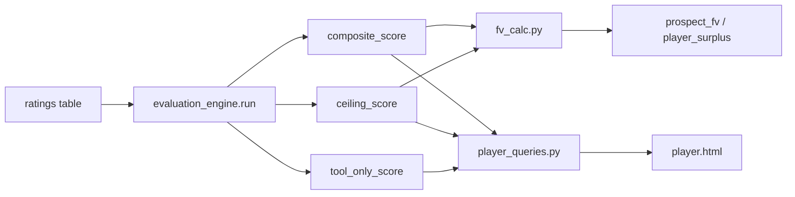
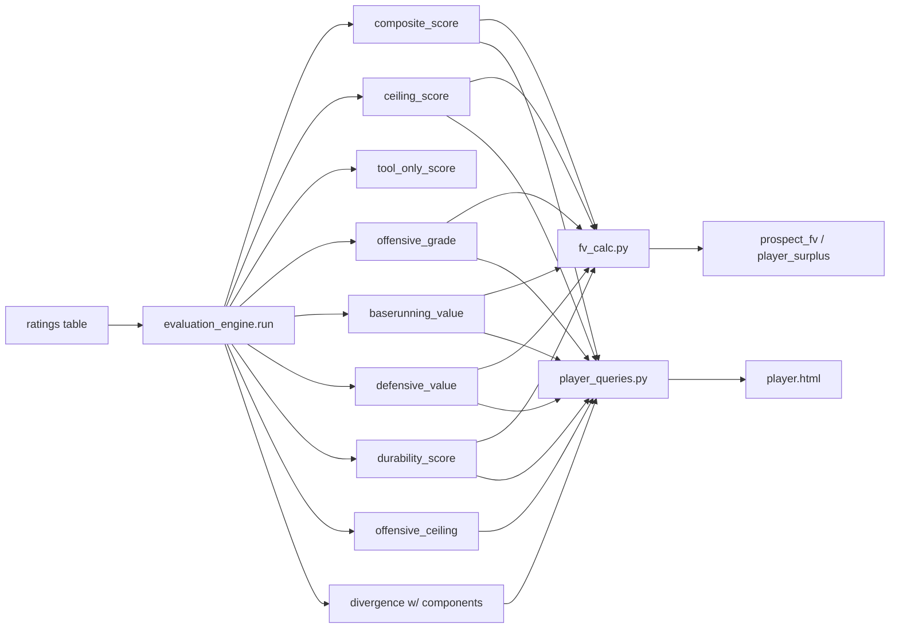

# Design Document: Evaluation Engine Reframe

## Overview

The evaluation engine currently produces a single `composite_score` as a replacement for OVR. This reframe restructures the engine's output to expose **component-level scores** (offensive grade, baserunning value, defensive value, durability score) as first-class outputs, while retaining the composite as a secondary convenience metric. The computation logic (piecewise transform, WAR regression weights, recombination shares, stat blend, pitcher adjustments) stays the same — the change is in how intermediate results are surfaced, stored, and consumed downstream.

The reframe touches four layers:

1. **Evaluation Engine** (`evaluation_engine.py`) — extract component scores from the existing computation pipeline and add them to `EvaluationResult`; enrich divergence detection with component-level context.
2. **Database** — add component score columns to the `ratings` table and `ratings_history` table.
3. **FV Calculator** (`fv_calc.py`) — consume component scores directly instead of a single composite.
4. **Web UI** (`player_queries.py`, `player.html`) — display components prominently with composite as secondary.

### Design Principles

- **No formula changes**: The piecewise tool transform, WAR regression weights, recombination shares, stat blend, and pitcher adjustments are unchanged. `composite_score` must produce identical values before and after the reframe for the same inputs.
- **Pure computation**: All new component functions remain pure (no DB access, no side effects). The batch `run()` entry point remains the only function with side effects.
- **Additive schema changes**: New columns are added via `ALTER TABLE` migrations. No existing columns are removed or renamed.
- **Backward compatibility**: All downstream consumers (`fv_calc.py`, `player_queries.py`, web templates) fall back gracefully when component scores are `NULL` (legacy data).

## Architecture

### Current Data Flow



### Reframed Data Flow



### Module Responsibilities

| Module | Change | Side Effects |
|---|---|---|
| `evaluation_engine.py` | Add component extraction functions; enrich `EvaluationResult`; enrich divergence | None (pure computation) |
| `evaluation_engine.run()` | Write component scores to DB alongside composite | DB writes (existing pattern) |
| `db.py` | Add migration for new columns | Schema migration |
| `fv_calc.py` | Read component scores; use in FV formula | DB reads (existing pattern) |
| `player_queries.py` | Extract component scores from ratings row | DB reads (existing pattern) |
| `player.html` | Display component scores, reorder layout | None (template) |

## Components and Interfaces

### 1. Component Score Extraction Functions

These are new pure functions that extract intermediate values from the existing computation pipeline. They do not change the computation — they expose what `compute_composite_hitter` and `compute_composite_pitcher` already compute internally.

#### Hitter Components

```python
def compute_offensive_grade(
    tools: dict[str, int | None],
    weights: dict[str, float],
) -> int | None:
    """Compute offensive component from hitting tools only.
    
    Uses contact, gap, power, eye with the existing piecewise tool transform
    and calibrated tool weights. Excludes speed, steal, stl_rt, and defense.
    
    Returns:
        Integer on 20-80 scale, or None if all hitting tools are missing.
    """
```

The offensive grade isolates the hitting contribution. It applies `_tool_transform` to contact, gap, power, eye, then computes a weighted sum using only the offensive tool weights (re-normalized to sum to 1.0 over available tools). This is the same computation that happens inside `compute_composite_hitter`, but without the baserunning and defensive components.

```python
def compute_baserunning_value(
    tools: dict[str, int | None],
    weights: dict[str, float],
) -> int | None:
    """Compute baserunning component from speed, steal, and steal rating.
    
    Uses linear tool values (no piecewise transform — consistent with
    current composite behavior where speed/steal/stl_rt are not transformed).
    
    Returns:
        Integer on 20-80 scale, or None if all baserunning tools are missing.
    """
```

```python
def compute_defensive_value(
    defense: dict[str, int | None],
    def_weights: dict[str, float],
) -> int | None:
    """Compute defensive component from positional defensive tools.
    
    Uses the existing position-specific defensive weights from DEFENSIVE_WEIGHTS.
    This is the same defensive score computation already in compute_composite_hitter,
    extracted as a standalone function.
    
    Returns:
        Integer on 20-80 scale, or None if all defensive tools are missing.
    """
```

#### Pitcher Components

For pitchers, the existing `compute_composite_pitcher` already produces a single pitching composite. The new component is durability:

```python
def compute_durability_score(stamina: int | None, role: str) -> int | None:
    """Compute durability component for pitchers.
    
    For SP: returns stamina on the 20-80 scale (already normalized).
    For RP: returns None (stamina is not a meaningful differentiator).
    
    Returns:
        Integer on 20-80 scale for SP, None for RP or when stamina is missing.
    """
```

The pitching composite itself (stuff + movement + control + arsenal) is already computed by `compute_composite_pitcher`. It becomes the pitcher's primary component score, stored as `offensive_grade` in the unified schema (since pitchers don't have an offensive grade, this field is repurposed — see Data Models section for the rationale).

**Design Decision**: Rather than adding a separate `pitching_composite` column, we reuse the `offensive_grade` column for pitchers. The column semantics are "primary skill component" — offense for hitters, pitching for pitchers. This avoids schema proliferation and simplifies downstream consumers that need "the main component score" regardless of player type. The web layer uses the `is_pitcher` flag to label it correctly.

#### Composite Derivation from Components

```python
def derive_composite_from_components(
    offensive_grade: int,
    baserunning_value: int | None,
    defensive_value: int | None,
    recombination: dict[str, float],
) -> int:
    """Derive composite_score from component scores using recombination weights.
    
    This is the inverse of the current flow: instead of computing composite
    directly from tools, we compute it from the component scores using the
    same offense/defense/baserunning shares.
    
    The result MUST be identical to compute_composite_hitter for the same inputs.
    This function exists to verify the decomposition is lossless.
    
    Returns:
        Integer on 20-80 scale.
    """
```

**Critical constraint**: `derive_composite_from_components(off, br, def, recom)` must produce the same value as `compute_composite_hitter(tools, weights, defense, def_weights)` for the same player. This is the backward compatibility guarantee. The implementation achieves this by having `compute_composite_hitter` internally call the component functions and then recombine, rather than having two separate code paths.

### 2. Enriched Divergence Detection

```python
def detect_divergence(
    tool_only_score: int,
    ovr: int | None,
    components: dict[str, int | None] | None = None,
) -> dict | None:
    """Compare Tool_Only_Score against OVR with component-level context.
    
    When components are provided, identifies which dimensions contribute
    most to the overall divergence by comparing each component against
    the expected contribution from OVR.
    
    Args:
        tool_only_score: Pre-stat-blend score from tool ratings (20-80).
        ovr: Game engine's OVR rating, or None if unavailable.
        components: Dict with keys offensive_grade, baserunning_value,
            defensive_value. Optional — when None, returns the existing
            divergence dict without component context.
    
    Returns:
        None when OVR is None.
        Dict with existing keys (type, magnitude, tool_only_score, ovr)
        plus new key:
        - "component_context": list of dicts identifying which components
          are most responsible for the divergence, sorted by contribution
          magnitude. Each entry has "component" (name) and "value" (score).
          Only included when components are provided and divergence exists.
    """
```

The component context works by ranking the component scores. When a player is a hidden gem (tools >> OVR), the component context shows which dimensions are strongest — e.g., "offensive_grade: 65, baserunning_value: 55, defensive_value: 40" tells the analyst the divergence is offense-driven. This doesn't require knowing the OVR's component breakdown (which we don't have), but it provides actionable context about where the tool-based value comes from.

### 3. Component-Level Ceilings

```python
def compute_component_ceilings(
    potential_tools: dict[str, int | None],
    weights: dict[str, float],
    current_components: dict[str, int | None],
    defense: dict[str, int | None] | None = None,
    def_weights: dict[str, float] | None = None,
    is_pitcher: bool = False,
    arsenal: dict[str, int] | None = None,
    stamina: int = 50,
    role: str = "SP",
    age: int = 25,
) -> dict[str, int | None]:
    """Compute component-level ceilings from potential tool ratings.
    
    Applies the same component formulas to potential tools, with the
    age-weighted blend applied per-component (each component's ceiling
    is floored at its current value).
    
    Returns:
        Dict with keys: offensive_ceiling, baserunning_ceiling,
        defensive_ceiling, durability_ceiling (pitchers only).
    """
```

### 4. Enriched EvaluationResult

```python
@dataclass
class EvaluationResult:
    """Result of evaluating a single player."""
    player_id: int
    composite_score: int              # 20-80, current ability (primary role)
    ceiling_score: int                # 20-80, projected peak (primary role)
    tool_only_score: int              # 20-80, pre-stat-blend
    
    # Component scores (new)
    offensive_grade: int | None = None       # hitting for hitters, pitching for pitchers
    baserunning_value: int | None = None     # hitters only
    defensive_value: int | None = None       # hitters only
    durability_score: int | None = None      # SP only
    
    # Component ceilings (new)
    offensive_ceiling: int | None = None
    baserunning_ceiling: int | None = None
    defensive_ceiling: int | None = None
    
    # Existing fields
    secondary_composite: int | None = None
    secondary_ceiling: int | None = None
    is_two_way: bool = False
    combined_value: int | None = None
    archetype: str = ""
    carrying_tools: list[str] = field(default_factory=list)
    red_flag_tools: list[str] = field(default_factory=list)
    divergence: dict[str, Any] | None = None
    confidence: str = "full"
```

### 5. FV Calculator Changes

The FV formula in `fv_model.py` currently uses `p["Ovr"]` (which is set to `composite_score` when custom scores are enabled) and `p["Pot"]` (set to `ceiling_score`). The reframe changes `fv_calc.py` to pass component scores through to `calc_fv`, which can then use them for the defensive bonus logic.

```python
# In fv_calc.py run(), after reading component scores from DB:
if use_custom_scores and p.get("defensive_value") is not None:
    p["_defensive_value"] = p["defensive_value"]

# In fv_model.py calc_fv(), replace defensive_score() call:
if p.get("_defensive_value") is not None:
    wt = p["_defensive_value"]  # Use pre-computed component directly
else:
    wt = defensive_score(p, bucket)  # Fallback to raw tool computation
```

**Design Decision**: The FV formula continues to use `Ovr` (composite) as the base score for the FV calculation. The component scores are used specifically for the defensive bonus logic, where `defensive_value` replaces the `defensive_score()` call that currently re-derives defense from raw tools. This is a targeted change — the full FV formula restructuring (using components as separate inputs to a multi-dimensional FV model) is deferred to a future iteration once we have data on how component scores correlate with outcomes.

**FV tier discrepancy warning**: When the component-based defensive bonus produces an FV grade that differs from what the old `defensive_score()` path would have produced by more than one FV tier, `fv_calc.py` logs a warning. This is a safety net during the transition.

### 6. Web UI Changes

#### player_queries.py

`_build_evaluation_data` is extended to extract component scores from the ratings row:

```python
result["offensive_grade"] = rd.get("offensive_grade")
result["baserunning_value"] = rd.get("baserunning_value")
result["defensive_value"] = rd.get("defensive_value")
result["durability_score"] = rd.get("durability_score")
result["offensive_ceiling"] = rd.get("offensive_ceiling")
```

#### player.html

The evaluation summary section is restructured:

**Current layout:**
```
Comp / Ceil: 58 / 65    OVR / POT: 55 / 60 [+3 Hidden Gem]
```

**New layout:**
```
┌─────────────────────────────────────────────┐
│ Component Scores                            │
│  Offense: 62    Baserunning: 48    Def: 40  │
│  Composite: 58 / Ceiling: 65                │
│                                             │
│ OVR / POT: 55 / 60                          │
│  [+3 Hidden Gem — offense-driven]           │
│                                             │
│ Tool Profile: power-over-hit                │
│  Carrying: power  Red Flags: speed          │
└─────────────────────────────────────────────┘
```

For pitchers:
```
┌─────────────────────────────────────────────┐
│ Component Scores                            │
│  Pitching: 60    Durability: 55             │
│  Composite: 58 / Ceiling: 65               │
└─────────────────────────────────────────────┘
```

Component scores use the existing `grade()` macro with color-coded grade bars. The composite moves to a secondary line below the components.

### 7. Snapshot Delta Enrichment

`compute_snapshot_deltas` is extended to include component-level deltas:

```python
def compute_snapshot_deltas(current, previous) -> dict:
    # ... existing tool_deltas, composite_delta, ceiling_delta ...
    # New: component deltas
    "offensive_delta": int,       # current - previous offensive_grade
    "baserunning_delta": int,     # current - previous baserunning_value
    "defensive_delta": int,       # current - previous defensive_value
    "top_component_change": str,  # which component changed most
```

## Data Models

### ratings table — new columns

| Column | Type | Description |
|---|---|---|
| `offensive_grade` | INTEGER | 20-80, hitting for hitters / pitching for pitchers |
| `baserunning_value` | INTEGER | 20-80, hitters only (NULL for pitchers) |
| `defensive_value` | INTEGER | 20-80, hitters only (NULL for pitchers) |
| `durability_score` | INTEGER | 20-80, SP only (NULL for RP and hitters) |
| `offensive_ceiling` | INTEGER | 20-80, ceiling for primary component |

**Design Decision**: New columns on the existing `ratings` table rather than a separate `component_scores` table. Rationale:
- Component scores are 1:1 with ratings rows (same player, same snapshot).
- A separate table would require JOINs in every query that needs components, adding complexity for no normalization benefit.
- The `ratings` table already has ~80 columns — 5 more is marginal.
- The migration pattern (ALTER TABLE ADD COLUMN) is already established for this table.

### ratings_history table — new columns

Same 5 columns added to `ratings_history` for development tracking:

| Column | Type | Description |
|---|---|---|
| `offensive_grade` | INTEGER | Snapshot of offensive component |
| `baserunning_value` | INTEGER | Snapshot of baserunning component |
| `defensive_value` | INTEGER | Snapshot of defensive component |
| `durability_score` | INTEGER | Snapshot of durability component |
| `offensive_ceiling` | INTEGER | Snapshot of offensive ceiling |

### Migration

```python
def _migrate_ratings_components(conn: sqlite3.Connection):
    """Add component score columns to ratings and ratings_history."""
    new_cols = [
        ("offensive_grade", "INTEGER"),
        ("baserunning_value", "INTEGER"),
        ("defensive_value", "INTEGER"),
        ("durability_score", "INTEGER"),
        ("offensive_ceiling", "INTEGER"),
    ]
    for table in ("ratings", "ratings_history"):
        existing = {row[1] for row in conn.execute(f"PRAGMA table_info({table})").fetchall()}
        for col, typ in new_cols:
            if col not in existing:
                conn.execute(f"ALTER TABLE {table} ADD COLUMN {col} {typ}")
```

This follows the exact pattern of `_migrate_ratings()` and `_migrate_ratings_history()` in `db.py`.

### EvaluationResult → DB column mapping

| EvaluationResult field | DB column | Written by |
|---|---|---|
| `offensive_grade` | `offensive_grade` | `_run_impl` |
| `baserunning_value` | `baserunning_value` | `_run_impl` |
| `defensive_value` | `defensive_value` | `_run_impl` |
| `durability_score` | `durability_score` | `_run_impl` |
| `offensive_ceiling` | `offensive_ceiling` | `_run_impl` |

### fv_calc RATINGS_SQL update

The `RATINGS_SQL` query in `fv_calc.py` adds the new columns:

```sql
r.offensive_grade, r.baserunning_value, r.defensive_value,
r.durability_score, r.offensive_ceiling
```

## Correctness Properties

*A property is a characteristic or behavior that should hold true across all valid executions of a system — essentially, a formal statement about what the system should do. Properties serve as the bridge between human-readable specifications and machine-verifiable correctness guarantees.*

### Property 1: Component scores are bounded integers on the 20-80 scale

*For any* valid hitter tool dict (values in [20, 80] or None with at least one non-None tool per component) and valid weight dict (non-negative, summing to 1.0), `compute_offensive_grade`, `compute_baserunning_value`, and `compute_defensive_value` SHALL each return an integer in [20, 80].

*For any* valid pitcher tool dict and stamina in [20, 80] with role "SP", `compute_durability_score` SHALL return an integer in [20, 80].

**Validates: Requirements 1.1, 1.2, 1.3, 1.4, 2.2**

### Property 2: Partial tools produce valid component scores

*For any* hitter tool dict where at least one tool within a component is non-None and at least one is None, the corresponding component function SHALL return a valid integer in [20, 80] (not None). The function re-normalizes weights over available tools.

**Validates: Requirements 1.5**

### Property 3: Composite decomposition round-trip

*For any* valid hitter tool dict, weight dict, defensive tool dict, defensive weight dict, and recombination shares, computing the three component scores (offensive_grade, baserunning_value, defensive_value) and then recombining them via `derive_composite_from_components` using the same recombination shares SHALL produce a value identical to `compute_composite_hitter` called with the same inputs.

This is the backward compatibility guarantee: the decomposition into components is lossless.

**Validates: Requirements 3.3, 3.4**

### Property 4: Divergence report includes component context when components are provided

*For any* tool_only_score and OVR where |tool_only_score - OVR| >= 5 (divergence exists), and any non-None component scores dict, `detect_divergence` SHALL return a dict containing a `component_context` key whose value is a list of component entries sorted by value descending. Each entry SHALL contain the component name and its score.

**Validates: Requirements 4.5**

### Property 5: Component ceilings are floored at current component scores

*For any* valid current component scores and potential tool ratings, each component ceiling computed by `compute_component_ceilings` SHALL be >= the corresponding current component score. Additionally, each component ceiling SHALL be an integer in [20, 80].

**Validates: Requirements 6.5**

### Property 6: Component snapshot deltas are correct arithmetic differences

*For any* two rating snapshots that both contain component scores (offensive_grade, baserunning_value, defensive_value), `compute_snapshot_deltas` SHALL produce component deltas equal to (current - previous) for each component. The `top_component_change` field SHALL identify the component with the largest absolute delta.

**Validates: Requirements 7.2, 7.5**

### Property 7: RP durability is always None

*For any* stamina value in [20, 80], `compute_durability_score` with role "RP" SHALL return None.

**Validates: Requirements 2.3**

## Error Handling

### Missing Tools

- **Partial tools**: When some tools within a component are None, the component function re-normalizes weights over available tools and produces a score. This matches the existing `compute_composite_hitter` behavior.
- **All tools missing**: When all tools for a component are None, the function returns None. This propagates to the DB as NULL and the web layer falls back to not displaying that component.
- **Confidence flag**: The existing `confidence` field on `EvaluationResult` ("full" vs "partial") continues to reflect whether all core tools are present.

### Legacy Data

- **NULL component scores**: When component columns are NULL (pre-reframe data), all downstream consumers fall back:
  - `fv_calc.py` uses `composite_score` as the single input (existing behavior).
  - `player_queries.py` returns None for component fields.
  - `player.html` shows composite as the primary metric when components are absent.
- **Migration safety**: The `ALTER TABLE ADD COLUMN` migration adds columns with NULL default. Existing rows are unaffected.

### FV Tier Discrepancy

- When the component-based defensive bonus produces an FV grade differing from the old path by more than one tier (5 FV points), a warning is logged with the player ID and both FV values. This is a monitoring mechanism, not an error — the component-based value is used.

### Schema Migration Failures

- The migration function checks for existing columns before adding them (idempotent). If `ALTER TABLE` fails (e.g., disk full), the error propagates and the batch pipeline rolls back.

## Testing Strategy

### Property-Based Tests (Hypothesis)

The project already uses Hypothesis extensively (121 existing property tests in `test_evaluation_engine.py`). New property tests follow the same patterns and strategies.

**Library**: [Hypothesis](https://hypothesis.readthedocs.io/) (already in use)
**Minimum iterations**: 100 per property (Hypothesis default is 100, `@settings(max_examples=100)`)

Each property test references its design document property via a tag comment:

```python
# Feature: evaluation-engine-reframe, Property 1: Component scores are bounded integers on the 20-80 scale
```

**New property tests to add:**

| Property | Test | Generator |
|---|---|---|
| 1 | Component scores in [20, 80] | Reuse existing `hitter_tools_st`, `pitcher_tools_st` strategies |
| 2 | Partial tools produce valid scores | Custom strategy with mixed None/non-None tools |
| 3 | Composite round-trip | Reuse existing strategies + recombination weights |
| 4 | Divergence component context | Random scores + component dicts |
| 5 | Component ceilings >= current | Reuse existing ceiling test strategies |
| 6 | Component deltas arithmetic | Two random snapshot dicts with component scores |
| 7 | RP durability is None | Random stamina values |

### Unit Tests (Example-Based)

- **Structural tests**: Verify `EvaluationResult` has new fields, DB migration adds columns.
- **FV integration**: Verify `fv_calc.py` uses `defensive_value` when available, falls back when not.
- **Web layer**: Verify `_build_evaluation_data` extracts component scores, template renders them.
- **Edge cases**: All tools None → None component, RP durability → None, missing OVR → no divergence.

### Integration Tests

- **Pipeline test**: Run `_run_impl` on a seeded in-memory DB, verify component scores are written to `ratings` and `ratings_history`.
- **FV pipeline**: Run `fv_calc.run()` after evaluation engine, verify FV grades are produced using component scores.

### Regression Tests

- **Backward compatibility**: Run `compute_composite_hitter` with known inputs before and after the refactor, verify identical outputs. This is covered by Property 3 but also verified with concrete examples from the existing test suite.

