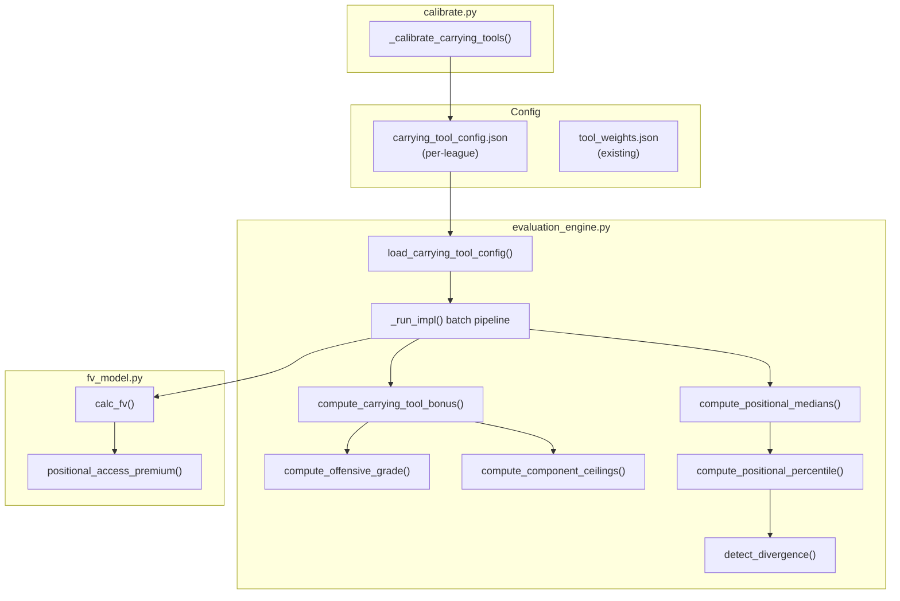

# Design Document: Positional Context Enhancement

## Overview

This feature adds positional context to the evaluation engine through four coordinated enhancements that address the core problem: the current engine measures raw tool quality without accounting for how valuable those tools are at a given position. A SS with a 51 offensive grade is one of the best hitters at the position, but the engine treats it the same as a 51 at 1B.

The four enhancements are:

1. **Carrying Tool Bonus** — An additive bonus to the offensive grade (and offensive ceiling) when a hitter possesses elite offensive tools (65+) that are scarce and high-impact at the player's position. Derived from empirical WAR premium data.
2. **Positional Context in Divergence Detection** — Divergence reports include the player's offensive grade percentile relative to position-specific medians, preventing false "landmine" flags for players who are above-average for their position.
3. **Defense as Positional Access in FV** — Replaces the generic defensive bonus in `calc_fv` with a positional access mechanism: at premium positions (SS, C, CF), adequate defense enables a positional value premium that scales with offensive grade.
4. **Ceiling Enhancement for Carrying Tools** — The carrying tool bonus applies to potential tool ratings in the ceiling calculation, so a SS prospect with potential Contact=80 gets a ceiling that reflects the franchise-defining value of elite contact at shortstop.

### Design Principles

- **Pure computation**: All new functions remain pure (no DB access, no side effects). The batch pipeline (`run()`) is the only function with side effects.
- **Additive, not replacement**: The carrying tool bonus is added after the base weighted average — it does not change the existing tool weight formulas.
- **Per-league configuration**: Bonus parameters are stored in the per-league config directory alongside `tool_weights.json`, allowing each league to have independent parameters derived from its own WAR data.
- **Backward compatible**: When no carrying tool config exists, behavior is identical to the current engine. All new fields in `EvaluationResult` default to `None` or empty.
- **Empirically grounded**: All parameters are derived from the WAR premium data in `docs/positional_context_findings.md` and can be re-derived by the calibration pipeline.

## Architecture

The feature touches four modules and one config file, with data flowing through the existing batch pipeline:



### Data Flow

1. **Config loading**: `_run_impl()` loads `carrying_tool_config.json` via `load_carrying_tool_config()`. If the file doesn't exist, a hardcoded default config (derived from the combined EMLB+VMLB findings) is used.
2. **First pass — compute offensive grades**: For each hitter, compute the base offensive grade, then apply the carrying tool bonus. Store the enhanced offensive grade in `EvaluationResult`.
3. **Positional medians**: After all MLB hitters have offensive grades, compute per-position medians from MLB-level players. Store in a dict keyed by position bucket.
4. **Second pass — divergence enrichment**: For each hitter with divergence, compute positional percentile and add annotations.
5. **FV pipeline**: `fv_calc.py` passes the enhanced offensive grade to `calc_fv()`, which uses the new positional access mechanism instead of the generic defensive bonus.
6. **Calibration**: `calibrate.py` gains a new `_calibrate_carrying_tools()` function that derives the config from WAR regression data.

### Key Decision: Two-Pass vs Single-Pass

The positional median computation requires all MLB offensive grades to be computed first. This means the batch pipeline needs a two-pass approach for divergence enrichment:

- **Pass 1**: Compute all scores (offensive grade with carrying tool bonus, composite, ceiling).
- **Median computation**: Aggregate MLB offensive grades by position bucket.
- **Pass 2**: Enrich divergence reports with positional context.

This is a minor structural change to `_run_impl()` — the existing single-pass loop splits into score computation and divergence enrichment phases.

## Components and Interfaces

### 1. Carrying Tool Config (`carrying_tool_config.json`)

A new per-league config file stored at `data/<league>/config/carrying_tool_config.json`.

```python
def load_carrying_tool_config(league_dir: Path) -> dict:
    """Load carrying tool configuration from the league config directory.

    Falls back to DEFAULT_CARRYING_TOOL_CONFIG when the file doesn't exist.
    Validates the config on load, raising ValueError for invalid entries.

    Args:
        league_dir: Path to the league data directory.

    Returns:
        Validated carrying tool config dict.

    Raises:
        ValueError: If any war_premium_factor is negative or any
            scarcity_multiplier value is non-positive.
    """
```

### 2. Carrying Tool Bonus Computation

New pure functions in `evaluation_engine.py`:

```python
def compute_carrying_tool_bonus(
    tools: dict[str, int | None],
    position: str,
    config: dict,
) -> tuple[float, list[dict]]:
    """Compute the additive carrying tool bonus for a hitter.

    For each offensive tool grading 65+, checks if the tool/position
    combination is defined as a carrying tool in the config. If so,
    computes: bonus = war_premium_factor × (tool_grade - 60) × scarcity_multiplier(tool_grade)

    Args:
        tools: Tool ratings dict with keys "contact", "gap", "power", "eye".
        position: Position bucket (e.g., "SS", "C", "CF").
        config: Carrying tool config dict.

    Returns:
        Tuple of (total_bonus: float, breakdown: list[dict]).
        Each breakdown entry has keys: "tool", "grade", "bonus".
    """
```

```python
def apply_carrying_tool_bonus(
    base_offensive_grade: float,
    tools: dict[str, int | None],
    position: str,
    config: dict,
) -> tuple[int, float, list[dict]]:
    """Apply carrying tool bonus to a base offensive grade.

    Computes the bonus, adds it to the base grade, and clamps to [20, 80].

    Args:
        base_offensive_grade: The unclamped offensive grade from _offensive_grade_raw().
        tools: Tool ratings dict.
        position: Position bucket.
        config: Carrying tool config dict.

    Returns:
        Tuple of (enhanced_grade: int, bonus_amount: float, breakdown: list[dict]).
    """
```

### 3. Positional Median Computation

New pure functions in `evaluation_engine.py`:

```python
def compute_positional_medians(
    offensive_grades: dict[str, list[int]],
    min_sample_size: int = 15,
) -> dict[str, dict]:
    """Compute per-position offensive grade medians and percentile thresholds.

    Args:
        offensive_grades: Dict mapping position bucket to list of offensive
            grades for MLB players at that position.
        min_sample_size: Minimum number of players per bucket. Buckets with
            fewer players are excluded.

    Returns:
        Dict mapping position bucket to {"median": int, "p25": int, "p75": int,
        "count": int}. Buckets with insufficient data are omitted.
    """
```

```python
def compute_positional_percentile(
    offensive_grade: int,
    position: str,
    medians: dict[str, dict],
    offensive_grades: dict[str, list[int]],
) -> float | None:
    """Compute a player's offensive grade percentile within their position.

    Args:
        offensive_grade: The player's offensive grade.
        position: Position bucket.
        medians: Output from compute_positional_medians().
        offensive_grades: The raw grade lists (needed for percentile rank).

    Returns:
        Percentile as a float in [0, 100], or None if position data unavailable.
    """
```

### 4. Enhanced Divergence Detection

The existing `detect_divergence()` gains an optional `positional_context` parameter:

```python
def detect_divergence(
    tool_only_score: int,
    ovr: int | None,
    components: dict[str, int | None] | None = None,
    positional_context: dict | None = None,
) -> dict | None:
    """Compare Tool_Only_Score against OVR to detect evaluation divergence.

    When positional_context is provided, adds a "positional_context" key
    to the result with percentile and annotation information.

    Args:
        ...existing args...
        positional_context: Optional dict with keys:
            "percentile": float (0-100),
            "position": str,
            "median": int.
            When provided, annotations are added for landmine/hidden_gem cases.

    Returns:
        Existing return format, plus optional "positional_context" key.
    """
```

The existing divergence thresholds (±5) are unchanged. The positional context is additive annotation only.

### 5. Positional Access Premium in FV

New function in `fv_model.py`:

```python
def positional_access_premium(
    bucket: str,
    offensive_grade: int,
    defensive_value: int,
    access_threshold: int = 50,
) -> float:
    """Compute the positional value premium for premium positions.

    At premium positions (SS, C, CF), adequate defense (>= threshold) enables
    a positional value premium that scales with offensive grade. Higher offense
    at a premium position with adequate defense produces a larger premium.

    For non-premium positions, returns 0.

    Args:
        bucket: Position bucket.
        offensive_grade: The player's offensive grade (20-80).
        defensive_value: The player's defensive value (20-80).
        access_threshold: Minimum defensive value to qualify for positional access.

    Returns:
        Premium value as a float (added to FV before rounding).
    """
```

The existing defensive bonus block in `calc_fv()` is replaced with a call to `positional_access_premium()` for premium positions, while non-premium positions retain the existing logic.

### 6. Calibration Extension

New function in `calibrate.py`:

```python
def _calibrate_carrying_tools(conn, game_year, role_map) -> dict | None:
    """Derive carrying tool parameters from WAR regression data.

    For each position/tool combination:
    1. Compute mean WAR for players with 65+ grade in that tool.
    2. Compute mean WAR for all players at that position.
    3. WAR premium = difference.
    4. Compute scarcity percentage (% of players with 65+ grade).

    Excludes speed at all positions. Excludes combinations with fewer
    than 10 qualifying players.

    Args:
        conn: SQLite connection.
        game_year: Current game year.
        role_map: Role mapping dict.

    Returns:
        Carrying tool config dict, or None if insufficient data.
    """
```

### 7. EvaluationResult Extensions

The existing `EvaluationResult` dataclass gains new fields:

```python
@dataclass
class EvaluationResult:
    ...existing fields...

    # Carrying tool bonus (new)
    carrying_tool_bonus: float = 0.0
    carrying_tool_breakdown: list[dict] = field(default_factory=list)
    ceiling_carrying_tool_bonus: float = 0.0
    ceiling_carrying_tool_breakdown: list[dict] = field(default_factory=list)

    # Positional context (new)
    positional_percentile: float | None = None
    positional_median: int | None = None
```

## Data Models

### Carrying Tool Config Schema

```json
{
  "version": 1,
  "source": "calibrated",
  "positions": {
    "SS": {
      "carrying_tools": {
        "contact": {"war_premium_factor": 0.30},
        "power":   {"war_premium_factor": 0.35},
        "eye":     {"war_premium_factor": 0.22}
      }
    },
    "C": {
      "carrying_tools": {
        "contact": {"war_premium_factor": 0.37},
        "power":   {"war_premium_factor": 0.40}
      }
    },
    "CF": {
      "carrying_tools": {
        "contact": {"war_premium_factor": 0.23},
        "power":   {"war_premium_factor": 0.30}
      }
    },
    "2B": {
      "carrying_tools": {
        "power":   {"war_premium_factor": 0.18},
        "contact": {"war_premium_factor": 0.10}
      }
    },
    "3B": {
      "carrying_tools": {
        "power":   {"war_premium_factor": 0.09},
        "contact": {"war_premium_factor": 0.12},
        "eye":     {"war_premium_factor": 0.12},
        "gap":     {"war_premium_factor": 0.12}
      }
    },
    "COF": {
      "carrying_tools": {
        "contact": {"war_premium_factor": 0.13}
      }
    },
    "1B": {
      "carrying_tools": {
        "contact": {"war_premium_factor": 0.16}
      }
    }
  },
  "scarcity_schedule": [
    {"threshold": 65, "multiplier": 1.0},
    {"threshold": 70, "multiplier": 1.5},
    {"threshold": 75, "multiplier": 2.0},
    {"threshold": 80, "multiplier": 3.0}
  ]
}
```

#### Design Decisions

**WAR premium factor derivation**: The `war_premium_factor` is not the raw WAR premium from the findings document. It's a scaled coefficient that, when multiplied by `(tool_grade - 60) × scarcity_multiplier`, produces a bonus on the 20-80 scouting scale. The scaling is: `factor = raw_war_premium / 5.0 × position_adjustment`. This produces bonuses in the range of +1 to +6 points on the 20-80 scale for a 65-grade tool, and +3 to +18 for an 80-grade tool — meaningful but not dominant.

**Scarcity schedule**: A lookup table rather than a continuous function. The table has four breakpoints (65, 70, 75, 80) with multipliers (1.0, 1.5, 2.0, 3.0). For grades between breakpoints, linear interpolation is used. This is simpler to configure and reason about than a quadratic curve, and the calibration pipeline can derive the breakpoints empirically.

**Bonus application point**: The bonus is applied to the unclamped offensive grade raw value (after `_offensive_grade_raw()` but before clamping to [20, 80]). This means the bonus interacts naturally with the existing piecewise transform — the transform has already been applied to individual tools, and the bonus adjusts the weighted average result. The bonus does not go through the piecewise transform itself.

**Speed and defense exclusion**: Speed is excluded at all positions because the empirical data shows zero or negative WAR premium for 65+ speed. Defense is excluded because elite defense is not scarce at premium positions (50% of SS have 65+ IFR).

### Positional Medians (Runtime Data)

Computed during the evaluation run, not persisted to config. Stored in a dict:

```python
{
    "SS": {"median": 45, "p25": 40, "p75": 51, "count": 99},
    "C":  {"median": 43, "p25": 38, "p75": 49, "count": 63},
    "CF": {"median": 47, "p25": 42, "p75": 53, "count": 57},
    ...
}
```

Computed from MLB-level hitters only (level=1), requiring a minimum of 15 players per bucket. Recomputed on each evaluation run from the current snapshot's offensive grades (after carrying tool bonus is applied).

### Positional Access Premium Parameters

Hardcoded in `fv_model.py` (not configurable per-league, since the mechanism is structural rather than empirical):

```python
POSITIONAL_ACCESS = {
    "SS": {"access_threshold": 50, "base_premium": 2.0, "offense_scale": 0.06},
    "C":  {"access_threshold": 50, "base_premium": 1.5, "offense_scale": 0.05},
    "CF": {"access_threshold": 50, "base_premium": 1.5, "offense_scale": 0.05},
}
```

The premium formula: `premium = base_premium + (offensive_grade - 40) × offense_scale` when `defensive_value >= access_threshold`. This produces:
- SS with 45 offense + 55 defense: premium = 2.0 + 5×0.06 = +2.3 FV points
- SS with 55 offense + 60 defense: premium = 2.0 + 15×0.06 = +2.9 FV points
- C with 50 offense + 55 defense: premium = 1.5 + 10×0.05 = +2.0 FV points

These magnitudes are derived from the empirical finding that elite defense at C adds +1.10 WAR and at CF adds +1.28 WAR when controlling for offense. On the FV scale, 1 WAR ≈ 2-3 FV points for prospects.

### Enhanced EvaluationResult

The `EvaluationResult` dataclass adds four new fields. All default to zero/None for backward compatibility:

| Field | Type | Default | Description |
|---|---|---|---|
| `carrying_tool_bonus` | `float` | `0.0` | Total bonus added to offensive grade |
| `carrying_tool_breakdown` | `list[dict]` | `[]` | Per-tool breakdown: `[{"tool": "contact", "grade": 70, "bonus": 2.1}]` |
| `ceiling_carrying_tool_bonus` | `float` | `0.0` | Total bonus added to offensive ceiling |
| `ceiling_carrying_tool_breakdown` | `list[dict]` | `[]` | Per-tool breakdown for ceiling |
| `positional_percentile` | `float \| None` | `None` | Offensive grade percentile within position |
| `positional_median` | `int \| None` | `None` | Position bucket's median offensive grade |

### DB Schema

No new tables. The `ratings` table already has `offensive_grade` and `offensive_ceiling` columns — these will now contain the enhanced values (with carrying tool bonus applied). The bonus breakdown is not persisted to the DB; it's available in the `EvaluationResult` for the current run and passed to the web UI via the player query layer.

To surface the bonus and positional context on the web UI, the player query layer will compute them on-the-fly from the stored offensive grade and the carrying tool config, or they can be added as new columns to `ratings` in a future iteration.


## Correctness Properties

*A property is a characteristic or behavior that should hold true across all valid executions of a system — essentially, a formal statement about what the system should do. Properties serve as the bridge between human-readable specifications and machine-verifiable correctness guarantees.*

### Property 1: Carrying tool bonus qualification

*For any* hitter tool ratings dict, position bucket, and carrying tool config, `compute_carrying_tool_bonus` SHALL return a non-zero bonus for a tool if and only if: (a) the tool is one of contact, gap, power, or eye; (b) the tool grades 65 or higher; and (c) the tool/position combination is defined in the config. For all other tools (speed, defensive tools) or grades below 65, the bonus SHALL be zero.

**Validates: Requirements 1.1, 1.5, 1.6, 1.8**

### Property 2: Carrying tool bonus formula and summation

*For any* hitter with one or more qualifying carrying tools, the enhanced offensive grade SHALL equal `clamp(base_offensive_grade_raw + total_bonus, 20, 80)`, where `total_bonus` is the sum of individual tool bonuses, and each individual bonus equals `war_premium_factor × (tool_grade - 60) × scarcity_multiplier(tool_grade)`.

**Validates: Requirements 1.2, 1.3, 1.4**

### Property 3: Carrying tool bonus monotonicity

*For any* position bucket and carrying tool combination, and any two tool grades `a` and `b` where `65 <= a < b <= 80`, the bonus for grade `b` SHALL be strictly greater than the bonus for grade `a`.

**Validates: Requirements 1.7**

### Property 4: Carrying tool config validation

*For any* carrying tool config dict containing a negative `war_premium_factor` or a non-positive `scarcity_multiplier` value, `load_carrying_tool_config` SHALL raise a `ValueError`.

**Validates: Requirements 2.5**

### Property 5: Positional median computation with minimum sample enforcement

*For any* dict mapping position buckets to lists of offensive grades, `compute_positional_medians` SHALL return the correct statistical median for each bucket with at least `min_sample_size` entries, and SHALL omit buckets with fewer entries.

**Validates: Requirements 3.7, 4.1, 4.4**

### Property 6: Positional percentile computation

*For any* list of offensive grades for a position bucket and any target grade, `compute_positional_percentile` SHALL return the correct percentile rank (percentage of grades in the list that are less than or equal to the target grade).

**Validates: Requirements 4.2**

### Property 7: Divergence positional context annotations

*For any* divergence result where positional context is provided, if the divergence type is "landmine" and the positional percentile is above the 60th percentile, OR the divergence type is "hidden_gem" and the positional percentile is below the 25th percentile, the result SHALL contain a "positional_context" annotation. Otherwise, no annotation SHALL be present.

**Validates: Requirements 3.1, 3.3, 3.4**

### Property 8: Divergence classification thresholds preserved

*For any* tool_only_score and OVR values, the divergence classification ("hidden_gem", "landmine", or "agreement") SHALL be determined solely by the ±5 threshold on `tool_only_score - ovr`, regardless of whether positional context is provided.

**Validates: Requirements 3.5**

### Property 9: Positional access premium at premium positions

*For any* prospect at a premium position (SS, C, CF), `positional_access_premium` SHALL return a positive premium if and only if `defensive_value >= access_threshold`. The premium SHALL be monotonically non-decreasing with offensive grade when defense meets the threshold.

**Validates: Requirements 5.1, 5.2, 5.3**

### Property 10: Non-premium position defensive bonus unchanged

*For any* prospect at a non-premium position (2B, 3B, COF, 1B), `positional_access_premium` SHALL return zero, and the existing defensive bonus logic in `calc_fv` SHALL produce the same result as before the change.

**Validates: Requirements 5.5**

### Property 11: Ceiling carrying tool bonus consistency

*For any* set of potential tool ratings and position bucket, the carrying tool bonus computed for the ceiling SHALL use the same formula and config as the bonus computed for current tool ratings. That is, `compute_carrying_tool_bonus(potential_tools, position, config)` SHALL produce the same result as `compute_carrying_tool_bonus(current_tools, position, config)` when the tool grades are identical.

**Validates: Requirements 6.1, 6.2, 6.3, 6.6**

## Error Handling

### Config Loading Errors

| Scenario | Behavior |
|---|---|
| `carrying_tool_config.json` missing | Use `DEFAULT_CARRYING_TOOL_CONFIG` silently |
| `carrying_tool_config.json` malformed JSON | Log warning, use default config |
| Config has negative `war_premium_factor` | Raise `ValueError` with descriptive message |
| Config has non-positive `scarcity_multiplier` | Raise `ValueError` with descriptive message |
| Config missing `positions` key | Use default config (treat as missing) |
| Config missing `scarcity_schedule` key | Use default scarcity schedule |

### Computation Edge Cases

| Scenario | Behavior |
|---|---|
| All offensive tools are `None` | `compute_carrying_tool_bonus` returns `(0.0, [])` |
| Position bucket not in config | No bonus applied (returns `(0.0, [])`) |
| Tool grade exactly 65 | Bonus computed (65 is the inclusive threshold) |
| Tool grade exactly 64 | No bonus (below threshold) |
| Enhanced offensive grade exceeds 80 | Clamped to 80 |
| Enhanced offensive grade below 20 | Clamped to 20 (unlikely but handled) |
| Position bucket has 0 MLB players | Positional median returns `None` for that bucket |
| Position bucket has exactly 15 players | Median computed (15 is the inclusive minimum) |
| Position bucket has 14 players | Median skipped, returns `None` |
| Positional medians unavailable | Divergence report produced without positional context |
| Prospect at premium position with `None` offensive grade | Fall back to existing defensive bonus logic |
| Prospect at premium position with `None` defensive value | No positional access premium (defense unknown) |

### Backward Compatibility

When no `carrying_tool_config.json` exists and no positional medians are computed (e.g., insufficient MLB data), the engine produces identical results to the pre-feature behavior:
- Offensive grade = base weighted average (no bonus)
- Divergence report = existing format (no positional context)
- FV calculation = existing defensive bonus (no positional access)
- Ceiling = existing formula (no ceiling bonus)

## Testing Strategy

### Property-Based Tests (Hypothesis)

The project already uses Hypothesis (`.hypothesis/` directory exists). All property tests will use Hypothesis with a minimum of 100 iterations per property.

Each property test will be tagged with a comment referencing the design property:
```python
# Feature: positional-context-enhancement, Property 1: Carrying tool bonus qualification
```

**Properties to implement:**

| Property | Test Function | Key Generators |
|---|---|---|
| P1: Bonus qualification | `test_carrying_tool_bonus_qualification` | Random tool dicts (20-80), random positions, random configs |
| P2: Bonus formula | `test_carrying_tool_bonus_formula` | Random qualifying tool grades (65-80), random config params |
| P3: Bonus monotonicity | `test_carrying_tool_bonus_monotonicity` | Random grade pairs (a < b, both 65-80), random positions |
| P4: Config validation | `test_carrying_tool_config_validation` | Random configs with negative/non-positive values |
| P5: Median computation | `test_positional_median_computation` | Random grade lists (varying sizes), random min_sample_size |
| P6: Percentile computation | `test_positional_percentile_computation` | Random grade lists, random target grades |
| P7: Divergence annotations | `test_divergence_positional_annotations` | Random divergence scenarios with positional context |
| P8: Divergence thresholds | `test_divergence_thresholds_preserved` | Random tool_only_score/ovr pairs, with/without positional context |
| P9: Positional access | `test_positional_access_premium` | Random premium-position prospects with varying offense/defense |
| P10: Non-premium unchanged | `test_non_premium_defensive_bonus` | Random non-premium-position prospects |
| P11: Ceiling consistency | `test_ceiling_carrying_tool_consistency` | Random tool grades applied as both current and potential |

### Unit Tests (Example-Based)

Unit tests cover specific examples, edge cases, and integration points:

| Test | Description |
|---|---|
| `test_default_config_structure` | Verify default config has all required position/tool combinations (Req 2.6) |
| `test_config_fallback_on_missing_file` | Verify default config used when file doesn't exist (Req 2.4) |
| `test_hudson_case` | Jeff Hudson (SS, off=51, def=63): verify not flagged as landmine with positional context (Finding 6) |
| `test_read_case` | Joe Read (SS prospect, pot_contact=80): verify ceiling reflects carrying tool bonus (Finding 7) |
| `test_evaluation_result_fields` | Verify new fields populated in EvaluationResult (Req 1.9, 6.4) |
| `test_fv_positional_access_ss` | SS with avg offense + elite defense gets positional premium (Req 5.1) |
| `test_fv_fallback_no_offensive_grade` | Legacy data without offensive grade uses existing logic (Req 5.6) |
| `test_composite_passthrough` | Enhanced offensive grade flows through to composite (Req 7.1) |

### Integration Tests

| Test | Description |
|---|---|
| `test_batch_pipeline_with_carrying_tools` | Full `_run_impl()` with mock data, verify carrying tool bonuses computed |
| `test_batch_pipeline_positional_medians` | Full pipeline, verify medians computed and divergence enriched |
| `test_calibration_carrying_tools` | `_calibrate_carrying_tools()` with mock DB data, verify config output |
| `test_fv_calc_with_positional_access` | `fv_calc.run()` with mock data, verify FV reflects positional access |
